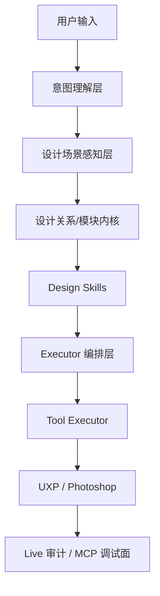

# Agent 架构系统复盘

> 文档权限：阶段性架构复盘，非当前开发真相源。
> 使用方式：只在核对“当时看到了什么问题”时参考，不作为当前任务入口。
> 不可覆盖：`project-memory/Prompt.md`、`project-memory/CurrentTask.md`、`docs/documentation-governance.md`、`docs/design-agent-operating-system.md`、`project-memory/Plan.md`。

## 目标

把当前 DesignEcho 从“功能很多、判断分散”的系统，收成一个真正的设计 Agent：

1. 先理解用户到底要什么
2. 再理解当前 Photoshop 里有什么
3. 再决定怎么设计
4. 最后才执行 Photoshop 动作

## 当前真实架构

### 1. 对话与意图入口

当前主入口在：

- `C:\UXP\2.0\DesignEcho-Agent\src\renderer\services\agent-orchestration\orchestrator.ts`
- `C:\UXP\2.0\DesignEcho-Agent\src\renderer\services\agent-orchestration\routing.ts`
- `C:\UXP\2.0\DesignEcho-Agent\src\renderer\services\agent-orchestration\task-classifier.ts`
- `C:\UXP\2.0\DesignEcho-Agent\src\renderer\services\agent-orchestration\conversational.ts`

实际流程是：

1. 先做轻量意图判断
2. 再做模型分类
3. 再决定：
   - 直接回复
   - 走 skill
   - 走 autonomous agent

### 2. 业务技能层

当前已经有多条业务链：

- 详情页：`detail-page-design`
- 主图：`main-image-design`
- SKU：`sku-batch`
- 抠图：`matte-product`
- 项目图片分析：`project-image-analysis`

现在最成熟的是：

1. 详情页
2. 文案优化
3. MCP 调试面

### 3. Photoshop 执行层

当前执行层主要分两块：

- Agent 侧 tool executor  
  `C:\UXP\2.0\DesignEcho-Agent\src\renderer\services\tool-executor.service.ts`
- UXP/Photoshop 工具  
  `C:\UXP\2.0\DesignEcho-UXP\src\tools`

这一层已经具备很多真实动作能力：

- 读文档
- 读图层
- 放图
- 改文案
- 创建元素
- 导出
- 详情页模板解析

### 4. 调试与审计层

这部分是当前项目比较有价值的一层：

- Photoshop MCP host  
  `C:\UXP\2.0\DesignEcho-Agent\src\main\services\mcp-host-service.ts`
- detail-page placement / copy / visual 审计
- selected element / module / design context

说明当前项目已经不只是“执行工具”，而是开始有“看清自己做了什么”的能力。

## 当前架构的优点

### 1. 分层已经存在，不是完全混在一起

现在已经能看出几层：

1. 对话与路由
2. 设计 skill
3. 工具执行
4. UXP 动作
5. MCP 调试面

这说明现在不是推倒重来，而是可以继续往正确方向收。

### 2. 详情页已经开始 skill 化

详情页不再只是一个大 executor。

关键文件：

- `C:\UXP\2.0\DesignEcho-Agent\src\renderer\services\design-skills\detail-page-design.skill.ts`
- `C:\UXP\2.0\DesignEcho-Agent\src\renderer\services\skill-executors\detail-page.executor.ts`

当前已经开始形成：

- skill 决定怎么设计
- executor 决定怎么编排 Photoshop 动作

这条方向是对的。

### 3. 设计理解内核已经有雏形

当前已经存在这些共享能力：

- `detail-page-screen-plan.ts`
- `detail-page-visual-segmentation.ts`
- `detail-page-live-placement.ts`
- `detail-page-copy-layout-audit.ts`
- `design-selected-element-context.ts`
- `design-selected-module-context.ts`

说明系统已经开始从“业务硬编码”往“设计理解内核”走。

### 4. MCP 调试面已经成型

这点很关键。

现在不是只能猜：

- 为什么选错图
- 为什么文案跑偏
- 为什么 detail-page placement 出错

而是已经可以通过 MCP 查：

- 结构
- 屏规划
- visual modules
- selected design context
- placement truth
- copy layout truth

## 当前架构的主要问题

### 1. 意图理解仍然不够稳定

当前虽然已经补了：

- 纯对话问题不进 Photoshop
- 模型身份/模型对比走 conversational

但主问题还在：

**意图理解仍然偏“规则先行，模型补充”。**

表现为：

1. 轻量路由规则太多
2. `task-classifier` 虽然存在，但经常是在规则之后发挥作用
3. “真实理解”还没有成为系统的绝对第一优先级

结果就是：

- 用户的问题明明是问答
- 系统却容易把它理解成任务执行

### 2. 技能和内核还没有彻底分开

现在 detail-page 已经开始拆 skill，但还没彻底。

仍然存在这些问题：

1. executor 里还有设计策略
2. skill 里还夹着感知细节
3. core 还没有统一 schema

也就是说：

**现在已经不是“大 executor”，但还不是“清晰的 core + skill + executor”。**

### 3. Photoshop 感知能力还只是局部能力，不是统一内核

当前已经有：

- selected element context
- selected module context
- selected design context

但还缺：

1. 统一的 `DesignElement`
2. 统一的 `DesignRelation`
3. 统一的 `DesignModule`
4. 统一的 `DesignScene`

所以现在更多还是：

- 某个功能需要什么，就临时构建什么上下文

而不是：

- 系统始终维护一套统一的设计场景模型

### 4. 详情页还是系统最重的链路

详情页现在已经很强，但它也暴露出一个问题：

**设计理解能力还是首先在 detail-page 上长出来，而不是在 core 上长出来。**

这样会有两个风险：

1. 主图和 SKU 很难真正复用
2. 详情页会持续吸走越来越多的系统复杂度

### 5. 参考图能力还没有进入“动作规划”

当前系统能：

- 看图
- 分析图
- 生成内容

但还不能稳定做到：

- 从参考图提取结构
- 决定哪些元素复用
- 决定哪些元素新建
- 决定 Photoshop 里该执行哪些动作

这也是为什么系统现在更像“会处理任务”，还不像“会设计”。

## 当前最需要明确的一件事

当前项目不能继续按这条路增长：

1. 详情页继续加逻辑
2. 主图继续加逻辑
3. SKU 继续加逻辑

这样最后会变成三套越来越重的业务系统。

正确方向应该是：

### Core

系统先看懂当前设计场景：

1. 画布里有哪些元素
2. 每个元素是什么
3. 它们之间是什么关系
4. 哪些元素属于同一个模块
5. 哪些模块构成一屏

### Skills

然后 skill 再决定：

1. 详情页怎么设计
2. 主图怎么设计
3. SKU 怎么生成
4. 参考图怎么迁移

### Executor

最后 executor 再去做：

1. 调工具
2. 控顺序
3. 执行动作
4. 回读真相

## 推荐的目标架构

## 每层应该负责什么

### 1. 意图理解层

负责：

- 用户是在问问题，还是要执行任务
- 是详情页、主图、SKU，还是纯对话
- 当前到底是“解释”“分析”“规划”还是“执行”

不负责：

- Photoshop 文档读取
- 工具执行

### 2. 设计场景感知层

负责：

- 当前选中了什么
- 这个元素在哪里
- 是文本、图片、形状、组还是背景
- 它所在父组、兄弟、邻近层是谁

对应后续应统一成：

- `DesignElement`
- `DesignScene`

### 3. 设计关系/模块内核

负责：

- 对齐
- 间距
- 附着
- 主次
- 模块归属
- 屏边界

对应后续应统一成：

- `DesignRelation`
- `DesignModule`
- `DesignScreen`

### 4. Design Skills

负责“怎么设计”：

- 详情页每屏讲什么
- 主图视觉重心怎么组织
- SKU 哪些变化是同一视觉框架下的变化
- 参考图迁移到当前 PSD 的设计策略

### 5. Executor 编排层

负责：

- 先做什么后做什么
- 哪一步需要审计
- 哪一步失败可以重试
- 哪一步必须停止

### 6. Tool Executor / UXP

只负责真实动作：

- 读图层
- 建元素
- 改文案
- 放图
- 导出

不负责语义决策。

## 当前最需要补的核心能力

### 1. 统一设计场景模型

应该正式定义：

- `DesignElement`
- `DesignRelation`
- `DesignModule`
- `DesignScene`

当前相关雏形已经有，但还没统一。

### 2. 让 selected context 成为正式入口

现在已经有：

- `scene.get_selected_element_context`
- `scene.get_selected_module_context`
- `scene.get_selected_design_context`

下一步不是再加更多碎工具，而是让它们成为：

**所有设计 skill 的统一入口。**

### 3. 把视觉分块正式提升为主输入之一

当前详情页已经有视觉分割，但还不够统一。

需要把：

- visual modules
- screen boundaries
- segmentation merge

从 detail-page 特有能力，提升为更通用的 scene core。

### 4. 参考图 -> 动作规划

这一步很关键。

未来系统不该只是：

- 看参考图
- 说几句分析

而应该能：

1. 识别参考图里的模块
2. 对照当前 PSD 的元素和模块
3. 规划：
   - 复用
   - 新建
   - 替换
   - 调整

## 当前系统性的技术债

### 1. 中文编码债

这是真实问题，不是只在终端显示层。

要继续坚持：

1. 用户可见链优先清
2. 进入逻辑判断的中文优先清
3. 注释最后清

### 2. 硬编码路由债

当前 `routing.ts` 里仍然有较多 keyword 路由。

这不是短期必须全部删掉，但要逐步让位给：

- model intent understanding
- explicit plan
- constraint validation

### 3. skill / executor / core 边界债

现在这三层开始成形，但还不够干净。

这是接下来最需要持续收口的地方。

## 下一阶段建议

### Phase 1

统一设计场景模型：

1. `DesignElement`
2. `DesignRelation`
3. `DesignModule`
4. `DesignScene`

### Phase 2

让 detail-page skill、main-image skill 开始直接吃 `SelectedDesignContext` 和统一 scene 模型。

SKU 暂时不动。

### Phase 3

引入参考图动作规划：

- `design.plan_from_reference`
- `design.compare_reference_to_canvas`
- `design.propose_element_actions`

### Phase 4

再回头收意图理解链，把更多“对话 vs 执行”的判断从轻量规则迁回模型主导。

## 直接结论

当前 Agent 已经不是简单工具集了，但也还不是成熟的设计 Agent。

它正处在这个阶段：

1. 对话和技能框架已经有
2. 详情页 skill 化已经开始
3. MCP 调试面已经成型
4. 设计理解内核已经有雏形

真正还缺的是：

**把 Photoshop 元素理解、关系建模、模块识别、参考图动作规划，正式做成系统的一等能力。**

只有这一步做好，系统才会从“会做任务”变成“会设计”。
