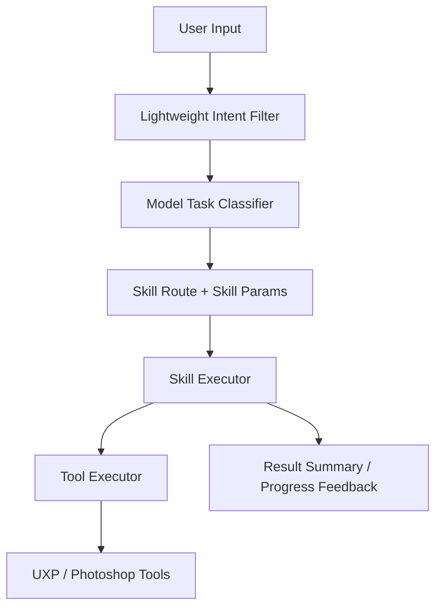
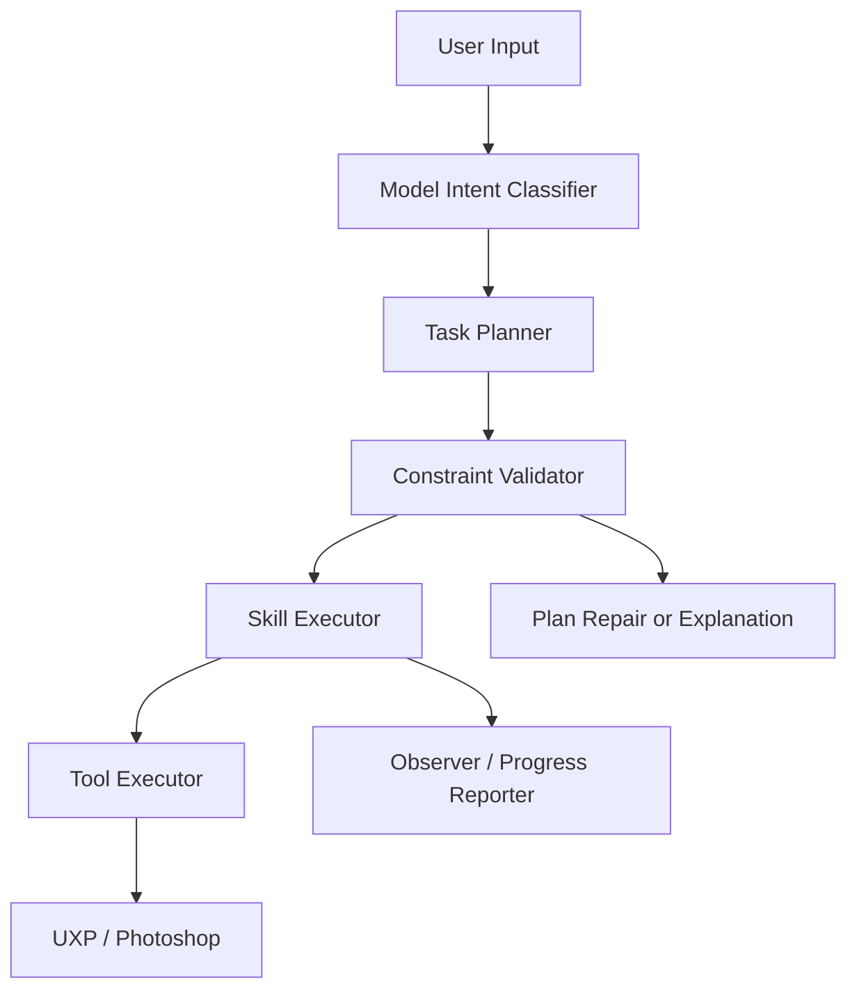
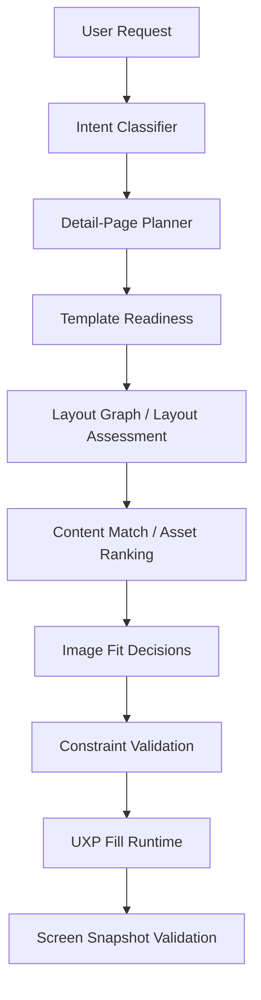

# DesignEcho Desktop Agent Architecture

> 文档权限：研究/过渡架构草案，非当前开发真相源。
> 使用方式：只在回看历史架构思路或比对旧分层时参考。
> 不可覆盖：`project-memory/Prompt.md`、`project-memory/CurrentTask.md`、`docs/documentation-governance.md`、`docs/design-agent-operating-system.md`、`project-memory/Plan.md`。

## Goal

Make the desktop agent behave like an actual agent:

- model understands the user's real intent first
- model proposes a task plan
- rules validate feasibility and safety
- executors perform deterministic work
- tools only execute operations
- runtime reports real progress and real constraints

This architecture applies to:

- SKU generation
- main-image design
- detail-page design
- matte / remove background

## Current Core Flow

## Layer Breakdown

### 1. Conversation Gate

Purpose:

- distinguish casual chat from actionable work
- avoid wasting planning/execution on simple conversation

Current files:

- `C:\UXP\2.0\DesignEcho-Agent\src\renderer\services\agent-orchestration\routing.ts`
- `C:\UXP\2.0\DesignEcho-Agent\src\renderer\services\agent-orchestration\conversational.ts`

Current problem:

- lightweight conversation detection is fine
- but deterministic routing still remains too strong for real design work

### 2. Intent Classification

Purpose:

- let the model decide what the user really wants
- choose between:
  - direct response
  - deterministic skill
  - autonomous agent

Current file:

- `C:\UXP\2.0\DesignEcho-Agent\src\renderer\services\agent-orchestration\task-classifier.ts`

Current improvement already done:

- classifier now supports returning `skillParams`
- classifier is no longer limited to only `skillId` and `mode`

Why this matters:

- SKU can express "default batch", "append combo", "only make this combo"
- detail-page can express "inspect only" vs "actually design"
- main-image can express image type and copy direction

### 3. Planning Layer

Purpose:

- convert user language into a concrete execution plan
- keep this plan explicit and inspectable

Planning output should include:

- task mode
- scope
- constraints
- expected output
- fallback behavior
- reasoning in user-facing Chinese

Examples:

- SKU:
  - default batch
  - specified-only
  - append
  - target sizes
  - note strategy
- detail page:
  - inspect only
  - fix structure first
  - fill content
  - validate then export
- main image:
  - click image / white-background / scene
  - copy intensity
  - placement preference

Current status:

- SKU already has a planning center in:
  - `C:\UXP\2.0\DesignEcho-Agent\src\renderer\services\skill-executors\sku-batch.executor.ts`
- detail-page and main-image still rely too much on executor defaults

### 4. Constraint Validation Layer

Purpose:

- rules no longer drive the whole task
- rules only verify whether the model plan is feasible

Rules should check:

- template existence
- document state
- project path availability
- legal sizes / valid colors
- duplicate combos
- unsupported note templates
- non-destructive safety

Behavior:

- if the plan is valid: execute it
- if partially invalid: revise plan or degrade gracefully
- if impossible: tell the user the exact reason

This is the key principle:

> model decides, rules validate

not:

> rules decide, model decorates

### 5. Skill Executor Layer

Purpose:

- own the workflow for one business capability
- call tools in the correct order
- produce user-facing progress and result summary

Current file:

- `C:\UXP\2.0\DesignEcho-Agent\src\renderer\services\skill-executors\index.ts`

Current registered skill families:

- matte-product
- main-image-design
- detail-page-design
- sku-batch
- autonomous-agent
- other supporting skills

Design rule:

- executors should not invent strategy if the planner already decided
- executors should not expose raw tool internals to the user
- executors should report real stage progress

### 6. Tool Execution Layer

Purpose:

- expose a stable, deterministic action interface to executors and autonomous agents

Current file:

- `C:\UXP\2.0\DesignEcho-Agent\src\renderer\services\tool-executor.service.ts`

This layer should:

- execute tools
- normalize tool parameters
- map agent-friendly tool names to real UXP operations

This layer should not:

- perform business planning
- decide design strategy
- choose SKU policy

### 7. UXP / Photoshop Runtime Layer

Purpose:

- perform real document operations
- remain deterministic
- never make semantic decisions

Examples:

- fill detail page
- set text content
- place image
- execute SKU layout
- create masks
- export files

Rule:

- UXP tools execute
- Agent decides

## Design Debugging Layer

Professional design debugging needs its own tool layer instead of relying on logs alone.

For detail-page work, the agent must be able to inspect:

- parsed placeholder containers
- actual placed image bounds
- clipping base relationships
- per-screen visual snapshots with debug overlays

Current debug tools:

- `auditDetailPagePlacement`
  - compares target bounds vs actual placed bounds
  - detects offset risk
  - detects stacking / overlap risk
- `getScreenSnapshotsWithOverlay`
  - captures each screen
  - draws target boxes and actual placement boxes on top

These tools exist to support:

- design debugging
- executor validation
- future `design-debug` skill workflows

## Current Architectural Problems

### Problem A: Deterministic route still hard-codes too much

Examples before current improvement:

- SKU always started with `countPerSize: 5, generateNotes: true`
- detail-page always started with fixed inspect/execute defaults
- matte and main-image were also partially fixed

This causes:

- user requests feel ignored
- responses feel mechanical
- model seems less intelligent than it actually is

### Problem B: Executors still emit mechanical progress language

Examples:

- parsing parameters
- mode display
- rigid status sentences

This causes:

- low trust
- poor product feel
- agent appears procedural rather than intelligent

### Problem C: Rules are still mixed into planning

Right now some rules still shape the task itself instead of only validating the plan.

This is why behavior still feels rigid.

## Target Architecture

## Execution Principles

### Principle 1

The model should decide **what** to do.

### Principle 2

Rules should decide whether the plan is **allowed and feasible**.

### Principle 3

Executors should decide **how to sequence tools**.

### Principle 4

Tools should only do **real actions**.

### Principle 5

User-facing feedback should describe:

- what the agent understood
- what it is doing now
- why it changed plan
- what constraints blocked part of the request

Not:

- raw internals
- tool names
- rigid parameter dumps

## Practical Roadmap

### Phase 1: Shared Agent Entry

Status:

- classifier can now return `skillParams`
- orchestrator now prefers model-provided params before default fallbacks

Files:

- `C:\UXP\2.0\DesignEcho-Agent\src\renderer\services\agent-orchestration\task-classifier.ts`
- `C:\UXP\2.0\DesignEcho-Agent\src\renderer\services\agent-orchestration\orchestrator.ts`

### Phase 2: SKU Executor Refactor

Goal:

- make SKU planning clearly model-first
- keep duplicate/template/size checks as validators
- replace mechanical progress with plan-based progress

### Phase 3: Detail Page Executor Refactor

Goal:

- model decides inspect vs repair vs fill vs validate
- layout graph and validation remain deterministic
- image placement must be container-aware, not only asset-aware
- clipping must anchor to the real placeholder base, not guessed layer names

### Phase 4: Main Image Executor Refactor

Goal:

- model decides image intent, copy density, visual direction
- executor keeps deterministic Photoshop actions

## Acceptance Standard

An agent flow is considered correct only if all of these are true:

- user intent is understood semantically before execution starts
- the execution plan is inspectable
- validation can explain why a plan was changed or rejected
- executors sequence work deterministically
- runtime tools do not make semantic design decisions
- user-facing feedback sounds like an agent, not a script

## Detail Page Specific Architecture

Detail-page work needs one extra rule:

> image placement is not only "pick image + fill mode".  
> it is also "which placeholder container, which clipping base, which target bounds, and which stack anchor".

That means the detail-page pipeline should be treated as:

### Detail-Page Planner Should Decide

- inspect only vs execute
- whether to repair structure first
- whether to fill copy only or copy + images
- whether export is allowed at the end

### Detail-Page Validators Should Check

- whether a placeholder has a real clipping base
- whether target bounds come from the placeholder container, not a guessed runtime layer
- whether multiple image placeholders accidentally share the same wrong anchor
- whether low-confidence screens should be downgraded to guarded mode

### Detail-Page Runtime Should Only Do

- place image
- move to the correct stack anchor
- scale to the validated target bounds
- position inside the validated container
- create clipping mask only when the placeholder relationship is explicit
- remove or hide the placeholder after successful replacement

### Detail-Page Runtime Must Not Do

- guess clipping from layer names alone
- guess target bounds from an unrelated live layer
- reuse one shared anchor for multiple placeholders without validation

## Current Detail-Page Alignment

After the current refactor:

- planning keeps `baseLayerId`, `referenceLayerId`, and `targetBounds`
- `targetBounds` now comes from parsed placeholder/base bounds instead of only runtime guesses
- image placement moves into the correct stack position before final scale/position
- clipping is no longer triggered by loose layer-name heuristics

Relevant files:

- `C:\\UXP\\2.0\\DesignEcho-Agent\\src\\renderer\\services\\skill-executors\\detail-page.executor.ts`
- `C:\\UXP\\2.0\\DesignEcho-Agent\\src\\renderer\\services\\skill-executors\\detail-page-plan-utils.ts`
- `C:\\UXP\\2.0\\DesignEcho-Agent\\src\\renderer\\services\\skill-executors\\detail-page-image-fit.ts`
- `C:\\UXP\\2.0\\DesignEcho-UXP\\src\\tools\\layout\\detail-page-filler.ts`
- `C:\\UXP\\2.0\\DesignEcho-UXP\\src\\tools\\layout\\detail-page-parser.ts`

The agent is acceptable when:

1. user intent changes are reflected without adding more hard-coded branches
2. the same architecture works for SKU, detail page, and main image
3. rules are visible as constraints, not as the personality of the system
4. user-facing feedback sounds like an agent with judgment, not a script with steps
