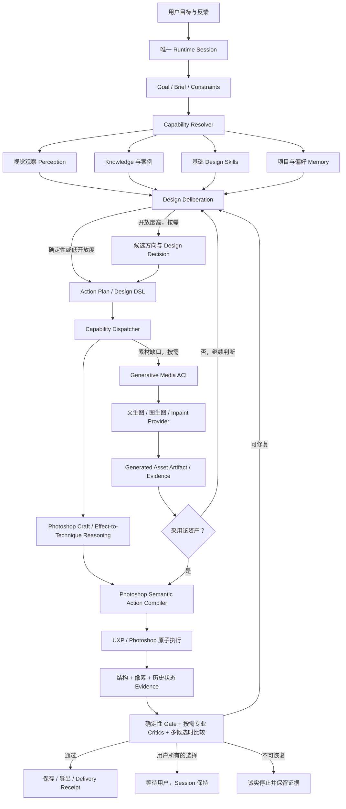

# DesignEcho 专业设计智能与能力系统实施方案

日期：2026-07-28

状态：`research_complete / feasibility_audited / foundation_contract_partial / runtime_vertical_not_started`

## 0. 文档治理声明

- 文档类型：C 层专项计划与研究支持文档。
- 是否能直接指导当前开发：只有当 `project-memory/CurrentTask.md` 与 `project-memory/Plan.md` 激活本文某个实施切片时，才可以指导该切片；本文不能自行改变当前开发优先级。
- 适用范围：DesignEcho Agent 的专业设计能力来源、基础设计 Capability、视觉观察、设计决策、Photoshop 专业工艺与语义执行、生成式素材、审美评价、经验学习与真实验收。
- 不能覆盖：`AGENTS.md`、`project-memory/Prompt.md`、`project-memory/CurrentTask.md`、`docs/documentation-governance.md`、`docs/design-agent-operating-system.md`、`project-memory/Plan.md` 与 `project-memory/Status.md`。
- 与现有文档的关系：
  - `docs/design-agent-operating-system.md` 仍是顶层架构真相源。
  - `docs/agent-governance-implementation-objective.md` 仍负责 Runtime、Capability、Stage 与验证链治理。
  - 本文只补足“专业设计能力本身从哪里来、怎样组合、怎样证明变好”这一专项，不建立第二套架构或第三套 Runtime。
  - 主图、详情页、SKU 的具体业务策略与用户可见默认值仍受业务治理和用户 checkpoint 约束；通用 Design Foundation、只读契约收敛和不改变业务输出的修复不因此停工。

### 0.1 2026-07-30 上位架构决策

本文的研究成果已并入 `project-memory/Plan.md` 的 F1～F3 与 V1 `NO-SKILL-DESIGN-VERTICAL-001`，但不再拥有独立开工顺序。只读 Task Profile、阶段化 Context 和 Craft Recipe 可以与执行 owner 收敛并行；任一真实写节点仍必须按 TaskRun + capability pack TransactionRunner + preflight + 可执行 R4 的会合依赖推进。Runtime 基础未闭合前，不通过继续扩 Skill、评价门禁或生成 Provider 解决任务无法持续执行的问题。

本轮同时收紧以下术语和 owner：

1. Design Kernel 是常驻通用设计底座；Skill 是品类、渠道和交付物特有的 overlay。无 Skill 时 Agent 仍应能执行开放式设计。
2. 本文历史上的 Evidence 统一解释为具体的 context、observation、operation result、verification 或开发验证记录；不建立产品 Runtime 的通用 Evidence 对象、阶段或 UI。
3. Evaluation baseline 仍是 M4 的质量测量前置，但不再先于 M3 的任务与执行所有权治理。
4. Photoshop 专业执行必须通过唯一 TransactionRunner；生成式素材只作为 AssetHandle provider，不拥有设计目标、任务状态或完成裁决。
5. 本文的 `DC-*` 切片只能映射到当前 Plan 的 F / V / M5～M7 里程碑，不拥有第二主线。只读 Foundation 可按 F 车道推进；涉及 Photoshop mutation、任务恢复、R4 调度、Release 或学习晋升的切片不得绕过 X1 / X2 与后续 Gate 依赖。

## 1. 核心结论

Design Agent 的专业能力不应以“建设一个更大的知识库”为中心。

权威能力公式是：

```text
Professional Design Capability
  = Model Reasoning
  × Grounded Visual Perception
  × General Design Kernel
  × Optional Domain Skill Overlays
  × Governed Knowledge
  × Photoshop Craft & Generative Media Actions
  × Observation-bound Evaluation
  × Reviewed Memory
  × Reliable TaskRun Harness
```

这是一条近似乘法链，而不是功能相加：

- 没有真实视觉观察，知识会变成脱离画面的空谈。
- 没有 Design Kernel，知识只回答“知道什么”，不能形成跨品类的结构、取舍、工艺与修订；Skill 只补充特定领域方法。
- 不理解 Photoshop 图层、蒙版、智能对象、调整层、混合模式、滤镜、选区与合成工艺，Tool 列表只是 API 菜单，不是可靠的手。
- 没有生成式素材能力，开放设计会受限于已有素材；但生成出一张图也不等于完成了设计。
- 没有可靠的 Photoshop 手，正确判断无法落成可编辑设计。
- 没有评价闭环，Agent 不知道修改后是变好还是变坏。
- 没有人类校准，模型自评容易形成自我确认。
- 没有 Harness 连续性，再好的模型也会在确认、失败、上下文变化或工具异常时停止。

因此，最佳方案不是“Knowledge-first”，而是：

```text
TaskRun and transaction ownership first
  → evaluation baseline
  → grounded eyes
  → transferable Design Kernel
  → semantic hands
  → comparative aesthetic review
  → reviewed learning
```

## 2. 产品定位与目标

DesignEcho 的目标不是把 Photoshop API 包装成聊天界面，也不是建立主图、详情页、SKU 三个自动化脚本。

目标产品是：

> 一个能够理解模糊设计目标、主动取得项目和画面观察、调用可迁移的专业设计能力、在 Adobe Photoshop 中形成可编辑结果、重新观察并评价、有限修正、最终交付的专业设计 Agent。

面向用户时，Agent 应接受：

- “帮我做详情页”
- “帮我做 SKU”
- “帮我做主图”
- “看看项目素材，帮我设计一张活动图”
- “这张图感觉不高级，帮我判断并修改”

用户不需要知道内部 Skill、Manifest、R0-R5、Tool 名称或 Photoshop 图层 API。

系统必须自己完成：

1. 识别目标和交付物。
2. 查看真实项目、素材和当前 Photoshop 状态。
3. 加载当前任务需要的基础设计能力。
4. 形成至少一个可解释的设计方向。
5. 生成可执行且可验证的动作计划。
6. 在 Photoshop 中执行真实修改。
7. 对最后一次写入后的同一文档版本重新观察。
8. 判断通过、修正、等待用户或诚实停止。
9. 保存可编辑文档和真实导出物。

## 3. 研究结论与项目决策

### 3.1 Agent 与 Workflow 的边界

[Anthropic《Building effective agents》](https://www.anthropic.com/engineering/building-effective-agents)区分了固定代码路径的 Workflow 与由模型动态决定过程、工具和反馈循环的 Agent，并建议从简单、可组合的模式开始。

项目决策：

- 开放设计由 Model 决定语义、取舍、观察目标和下一步。
- Manifest / Workflow 提供能力入口、阶段约束、输入输出和验收，不把 Photoshop 调用顺序写死。
- SKU 等规格明确的生产任务可以使用更确定的 Workflow，但 Workflow owner 不能被旁路原子写工具绕开。
- Harness 强制安全、上下文 / 操作结果 / 验证、预算和停止条件，不替模型代写设计方案。

### 3.2 Brain、Hands 与 Session 必须解耦

[Anthropic《Scaling Managed Agents: Decoupling the brain from the hands》](https://www.anthropic.com/engineering/managed-agents)主张把脑、执行环境与持久 Session 解耦，使用稳定接口承载不断变化的 Harness。

项目决策：

- Model + Harness 是脑；UXP / Photoshop 是可替换、可失败、可重新连接的手。
- TaskRun 是活动任务、计划、待确认交互和操作结果的唯一 owner；Run Record 只作审计投影，两者都不等于模型上下文窗口。
- Photoshop 断线或 UXP 重载不能抹掉目标、计划、待确认事项和已取得的观察 / 操作结果。
- Tool 失败返回给 Model 重新判断，不让失败的手拖死整个 Agent。

### 3.3 Skill 承载程序性知识，Knowledge 不承载执行权

[Anthropic《Equipping agents for the real world with Agent Skills》](https://www.anthropic.com/engineering/equipping-agents-for-the-real-world-with-agent-skills)把 Skill 定义为可发现、按需加载的指令、脚本与资源包，并强调渐进式披露和从评价开始建设 Skill。

项目决策：

- Knowledge 保存事实、原则、方法、案例和来源。
- Design Kernel 保存跨品类的“怎样理解、怎样组织、怎样形成结构、怎样选择工艺、怎样复核”；Skill 保存品类、渠道或交付物特有的输入、约束、计划片段和评价规则。
- 确定性计算交给代码；设计判断保留给 Model。
- 首先建设可迁移的基础设计能力，业务场景 Skill 只叠加这些能力没有覆盖的专业差异。
- 不把所有知识、图层树和历史一次性塞进 Prompt。

### 3.4 工具接口会改变 Agent 的实际能力

[SWE-agent 的 Agent-Computer Interface 研究](https://papers.nips.cc/paper_files/paper/2024/hash/5a7c947568c1b1328ccc5230172e1e7c-Abstract-Conference.html)说明，同一模型会因计算机接口设计不同而表现出显著差异。[Anthropic 的 Tool 设计实践](https://www.anthropic.com/engineering/writing-tools-for-agents)也强调工具描述、边界、结果形态和评价对成功率的影响。

项目决策：

- Photoshop 原子工具继续作为唯一真实执行底座。
- 在原子工具之上建设品类中立的语义设计动作，不直接向模型镜像底层 API。
- 每个语义动作必须声明目标、意图、保护范围、前置条件、后置条件与读回。
- 当前阶段只暴露最小充分 Tool surface；选中 Workflow 后优先保持 owner authority。

### 3.5 审美不能依赖单一分数或单一 VLM

[Adobe Agentic Design Review System](https://research.adobe.com/publication/agentic-design-review-system/)把 typography、color、alignment、spacing、composition 等交给不同专业评审，再由协调者汇总；其设计检索使用语义、空间与结构关系，而不是只看全图相似度。

[Adobe PRISM](https://research.adobe.com/publication/through-the-prism-principle-aware-interpretable-and-multi-scale-evaluation-of-visual-designs/)表明，通用视觉模型对细粒度设计原则破坏不够敏感，并提出确定性轻量评分、局部视觉反馈与全局推理组成的多尺度评价。

[Visual Aesthetic Benchmark](https://arxiv.org/abs/2605.12684)进一步显示，当前模型的单图分数不能可靠替代专家成对比较。

项目决策：

- 不使用一个“85 分”代表审美。
- 评价分为硬约束、结构原则、局部视觉、全局传播、候选比较与人类校准。
- Critic 必须输出问题位置、证据、违反原则、影响和可执行修正，不只输出分数。
- 重要开放设计优先比较候选，而不是让 Agent 为第一个方案辩护。

### 3.6 评价必须覆盖真实结果、轨迹和预算

[Anthropic《Demystifying evals for AI agents》](https://www.anthropic.com/engineering/demystifying-evals-for-ai-agents)建议组合代码、模型和人工 grader，并区分 Agent 的文字轨迹与真实环境结果。[OpenAI 关于可信 Agent 评价的实践](https://openai.com/index/trustworthy-third-party-evaluations-foundations/)强调，模型、Harness、工具、重试、预算和环境都是评价对象的一部分。

项目决策：

- 评价真实 PSD / PSB、导出图、目标图层和最后一次 Photoshop 历史状态。
- 同时记录完成率、重复成功率、工具错误、恢复、等待用户、总耗时与成本。
- Regression eval 接近确定性；Capability eval 允许探索能力上限。
- 自动视觉判官必须用专业设计师样本持续校准，并允许 `unknown / needs_review`。

### 3.7 Photoshop 执行必须是可取消、可追溯的事务

[Adobe Photoshop UXP `executeAsModal` 文档](https://developer.adobe.com/photoshop/uxp/2022/ps-reference/media/executeasmodal)要求修改 Photoshop 状态的操作在 modal scope 中执行，并支持取消、进度、历史控制和冲突超时。[Imaging API](https://developer.adobe.com/photoshop/uxp/2022/ps_reference/media/imaging/)可按 document、layer、history state 和 region 获取像素。

项目决策：

- 写入前绑定 documentId、layerId / region 与 before fingerprint。
- 同一写事务内串行执行相关原子动作。
- 写入后取得同文档、同目标的新结构和新画面。
- postcondition 不满足就不能声明该动作成功。
- 保存、导出与画面编辑分别授权和验收。

### 3.8 用户需要不同等级的创作控制

[Adobe 关于 Photoshop AI Assistant 的研究](https://research.adobe.com/news/do-it-for-me-or-show-me-how-the-research-behind-photoshops-ai-assistant/)指出，用户对“替我完成”和“告诉我怎么做”有不同需求。

项目决策：

- DesignEcho 只维护一个 Agent 和一套 Runtime。
- 在同一 Runtime 上提供自动、协作、指导三种控制模式。
- 控制模式只改变审批点、候选数量和展示深度，不复制三套业务逻辑。

## 4. 目标架构



架构不变量：

1. 只保留一个生产 Runtime Session。
2. Model 拥有 Brief、Strategy、候选方向和 Plan 的设计内容。
3. Harness 拥有 Capability、权限、连续性、Evidence、预算和完成边界。
4. Model 可以选择 Photoshop 工艺与生成式素材方案；只有已注册 Provider / Tool 才拥有真实动作权，自然语言不能伪造 mutation。
5. Evaluation 不授予 Tool 权限；Tool success 不授予质量通过。
6. Memory 不覆盖当前用户指令或新鲜环境事实。
7. 主图、详情页、SKU 和海报是组合能力的 Workflow，不是 Agent 核心分支。
8. 候选、生成式素材和 Photoshop 合成都属于条件路径；Harness 不要求每个设计都经过这些步骤。

## 5. 专业设计能力的七个来源

| 来源 | 责任 | 当前项目承载 | 本方案要求 |
|---|---|---|---|
| Model | 理解、权衡、形成方案、修订 | 多 Provider 路由与 autonomous Agent | 按角色选模型，不用升级模型掩盖 Harness 缺陷 |
| Perception | 看见画面、结构、素材与变化 | visual observation、scene graph、图层/快照工具 | 统一为新鲜、多尺度、目标绑定的 Evidence Bundle |
| Knowledge | 事实、原则、方法、案例 | method knowledge、搜索、Eagle、governance | 按阶段和缺口渐进加载，不建设无消费者的大库 |
| Design Skills | 程序性专业能力 | 业务 Skill 与少量通用方法 | 建立可迁移的基础设计能力目录 |
| Tools / ACI | 在 Photoshop 中执行并按需生成外部素材 | Tool Registry、UXP、布局引擎、BFL / 图像编辑 Provider | 补 Photoshop 工艺推理、语义动作、生成收据和事务读回，不替换原子真相源 |
| Evaluation | 判断目标与质量 | assertions、measurements、profiles、verdict | 多尺度、专业分面、候选比较与人类校准 |
| Memory | 保存偏好、项目事实和经验 | Design Project State、learning review | 只写入有来源、经复核、可失效的记忆 |

## 6. 基础设计 Capability 目录

下面是候选能力分类，不是立即新增十个用户可见 Skill，也不是十个独立 Agent。正式 Capability id 必须复用现有 v5 Catalog、Resolver、Knowledge 和 Evaluation owner。

| 基础能力 | 解决的问题 | 典型输出 | 主要评价 |
|---|---|---|---|
| 设计需求建模与能力选择 | 为了完成这个目标到底需要哪些事实、素材、专业方法、Skill、Provider 和 Photoshop 动作 | task model、required capability set、missing capability、execution strategy | 能力覆盖、无多余动作、缺口判断真实、路线可执行 |
| 目标与信息架构 | 画面要让谁先看懂什么 | communication goal、信息优先级、阅读路径 | 目标清晰、必含内容覆盖 |
| 构图与空间关系 | 主体、文字、装饰怎样形成视觉重心 | role、region、比例、对齐、留白、层级关系 | 平衡、焦点、节奏、遮挡 |
| 排版与字体 | 文字怎样形成可读层级与品牌气质 | type hierarchy、字体方向、字号/字重/行距关系 | 可读性、层级、字符气质、溢出 |
| 色彩与影调 | 色彩怎样服务主题、品牌和对比 | palette intent、对比、背景与强调色 | 对比、和谐、品牌一致性、失真 |
| 选图、裁切与主体尺度 | 哪张图适合什么角色，如何放得好看 | asset role、focal point、fit/crop/mask policy | 主体完整、比例、重心、裁切 |
| 商品真实性与场景融合（按需） | 设计效果不能破坏商品事实 | preserve constraints、光影/颜色/纹理边界 | 真实性、边缘、光影一致、非目标保持 |
| Photoshop 工艺与效果实现 | 期望的视觉效果怎样转成专业、非破坏性的图层关系与操作方法 | layer plan、effect decomposition、technique choice、fallback | 图层语义、可编辑性、效果正确、非目标保持 |
| 生成式素材规划与融入（按需） | 缺少背景、场景、纹理、装饰、插画或补景时生成什么、怎样约束并融入画面 | asset brief、conditioning、mask、候选、generation receipt、placement policy | 需求符合、真实性、瑕疵、风格、分辨率、来源与融合一致 |
| 内容视觉化 | 卖点怎样变成图文证据 | text-image mapping、icon/diagram/detail strategy | 卖点可见、证据对应、不夸大 |
| 艺术方向与品牌语言 | 多个选择怎样形成一致气质 | visual vocabulary、材质、光影、字体和效果规则 | 品牌一致、风格统一、参考未照抄 |
| 精修与完成度 | 怎样消除“像草稿”的细节问题 | spacing cleanup、edge cleanup、style consistency | 精度、统一、无溢出、无缺失 |
| 专业设计评审 | 哪里有问题、为什么、怎么修 | evidence-linked findings、revision intent | 问题召回、可操作性、修后改善 |

业务 Workflow 的本质是组合这些基础能力：

| Workflow | 主要组合 |
|---|---|
| 主图 | 信息架构 + 构图 + 选图/裁切 + 商品真实性 + Photoshop 工艺 + 排版 + 色彩 + 按需生成式素材 + 评审 |
| 详情页 | 内容视觉化 + 跨屏信息架构 + 构图 + 排版 + Photoshop 工艺 + 按需生成式素材 + 节奏一致性 + 评审 |
| SKU | 商品真实性 + 模板结构 + 主体尺度 + 批量一致性 + 标签排版 + 逐项验证 |
| 单画布海报 / KV | 信息架构 + 艺术方向 + 构图 + 排版 + 色彩 + Photoshop 工艺 + 按需生成式素材 + 候选比较 + 评审 |
| 局部编辑 | 精确目标 + 修改意图 + 非目标保持 + 写后读回 + 局部/整体复核 |

## 7. Knowledge 系统方案

### 7.1 Knowledge 不等于文档堆积

每条正式设计知识至少应包含：

```text
Knowledge Record
├── stable id / version
├── principle or method
├── why it matters
├── when to use
├── when not to use
├── positive examples
├── counterexamples
├── measurable signals
├── compatible Skill / Stage
├── provenance / review status
└── expiry / supersede relation
```

知识类型：

1. 通用设计原则：构图、排版、色彩、视觉层级、格式塔、可读性。
2. 专业方法：电商内容策略、商品真实性、长页叙事、缩略图传播。
3. 品牌与项目知识：品牌规则、商品事实、用户确认、平台约束。
4. 视觉案例：图片 + OCR + 元素/层级/空间图 + 设计点评 + 适用边界。
5. Photoshop recipe：经过验证的确定性构建或修复方法。
6. 失败反例：问题、根因、错误动作、正确恢复和验证证据。

### 7.2 渐进式检索

```text
Capability metadata
  → 当前缺口匹配
  → Knowledge 摘要
  → 必要方法正文
  → 必要案例与反例
```

规则：

- R1 只加载目标、事实、约束和 intake 所需知识。
- R3 加载内容、艺术方向和相关案例。
- R4 加载布局、执行和验证方法。
- R5 加载与实际 finding 对应的评价原则和修复 recipe。
- 未被本轮使用的知识不进入 Prompt。
- Knowledge 只能影响决策，不授予写入或完成权限。

### 7.3 不先建设重型向量库

在满足以下条件前，不把重型向量数据库或知识图谱放入主链：

- 已有不少于 100 个经评审的视觉案例。
- 当前关键词 / 结构 / metadata 检索的误召回已被量化。
- 有明确消费者证明向量检索能提升任务结果，而不只是检索数量。
- 能对案例来源、版本、撤回和照抄风险进行治理。

## 8. “眼睛”：统一 Visual Evidence Bundle

Agent 不应只看一张被压缩的全长截图。每次关键设计判断应按任务需要组合：

```text
Visual Evidence Bundle
├── document identity
├── history state / revision
├── full-canvas composite
├── thumbnail-scale view
├── target-region high-resolution crops
├── layer / module / screen graph
├── bounds / z-order / clipping / visibility
├── text content and typography facts
├── palette / contrast measurements
├── selected asset identity and source
├── before / after relation
├── observation confidence
└── freshness / invalidation reason
```

观察策略：

1. 全局尺度：传播目标、平衡、焦点、品牌气质。
2. 缩略尺度：主图、封面和首屏是否一眼可识别。
3. 模块尺度：某屏、某卡片或某信息组的层级和节奏。
4. 局部尺度：边缘、裁切、文字溢出、间距、细节精度。
5. 结构尺度：图层身份、父子关系、遮挡、剪切和可编辑性。

视觉模型只解释像素；稳定 ID、bounds、层级和 Photoshop revision 由 Harness 提供。两者都存在时，评价才算 grounded。

## 9. “大脑”：Design Deliberation

开放设计不应从 Brief 直接跳到原子 Photoshop 调用。

目标思考产物：

```text
Design Brief
  → Design Strategy
  → 2–3 low-cost Design Hypotheses
  → Candidate Preview / Layout Graph
  → Comparative Decision
  → Action Plan
```

每个 Design Hypothesis 至少包含：

- 首要传播目标。
- 主体与焦点。
- 信息层级。
- 构图与阅读路径。
- 色彩、字体和图像语言。
- 选择这些方案的理由。
- 必须保护的事实和画面关系。
- 预期风险。
- 可以如何验证。

候选策略：

- 规格化 SKU、明确局部操作不强制生成多个候选。
- 开放主图、海报、KV 和从零详情页优先生成 2–3 个低成本布局候选。
- 候选先在 DSL / preview 层比较，避免每个方向都完整写入 Photoshop。
- 选择记录必须绑定 Brief、候选证据和比较结果，不能由第一份方案自动胜出。

## 10. “双手”：Photoshop Craft 与 Generative Media ACI

### 10.1 Photoshop 语义动作

目标不是用新的语义工具替代原子 Tool Registry，而是在现有原子工具之上建立可验证的设计动作编译层。

候选语义动作：

```text
placeVisual(role, source, region, fitPolicy, focalPoint, preserve)
replaceVisual(target, source, fitPolicy, preserve)
establishHierarchy(elements, readingOrder, scaleRelations)
applyTypeSystem(textRoles, typographyIntent, regionConstraints)
applyColorSystem(targets, paletteIntent, contrastConstraints)
composeModule(modulePlan, sourceBindings, layerPolicy)
refineFinding(findingId, target, expectedChange, preserve)
```

每个动作必须编译为：

```text
Semantic Action
├── exact document / target
├── before fingerprint
├── ordered atomic operations
├── expected deltas
├── forbidden deltas
├── modal transaction / cancellation
├── structural readback
├── visual readback
└── action receipt
```

原则：

- 模型声明目标关系和设计意图，不盲猜绝对坐标。
- Layout Engine 计算确定性几何，模型可以基于读回修正关系。
- 原子 Tool 保留为语义动作编译目标、长尾修复和受控专家模式。
- 不把 batchPlay descriptor 直接暴露给模型。
- 同一批 Photoshop 写入串行，读取可以按现有并行策略并发。
- 失败不遗留半完成图层；能回滚则回滚，不能回滚则进入明确的 partial mutation 复核。

### 10.2 Photoshop Craft / Effect-to-Technique Reasoning

“会使用 Adobe Photoshop”不是记住工具名称，而是能把视觉意图拆成专业做法，并结合当前文档状态选择可执行路径：

```text
Visual Intent
  → Required Capability Decision
  → Effect Decomposition
  → Layer / Mask / Smart Object Plan
  → Technique Selection
  → Available Tool Mapping
  → Non-destructive Execution
  → Structural + Visual Readback
```

这是一项“判断需要什么”的能力，不是要求每个设计都走合成、生成或复杂 Photoshop 工艺。局部排版可能只需要文字和对齐；模板 SKU 可能只需要结构化替换；现有画面已经成立时可能只需调整层级；素材缺失时才调用生成 Provider；确有场景融合需要时才采用合成工艺。没有必要的动作不应被执行。

基础工艺知识至少覆盖：

- 图层、组、剪贴蒙版、图层蒙版、智能对象和可编辑文字的语义关系。
- 调整层、混合模式、透明度、图层样式、智能滤镜与非破坏性调色。
- 选区、主体边界、通道 / 蒙版思维、抠图边缘与局部保护。
- 缩放、裁切、透视、变形、景深、锐化、模糊、颗粒与质感统一。
- 商品合成中的接触阴影、环境光、反射、色温、透视、尺度与清晰度匹配。
- 长详情页的组结构、屏级命名、复用组件、可编辑性和切片交付。

每个正式 Photoshop recipe 至少声明：

```text
desired effect
preconditions
preferred non-destructive technique
required layer relations
available semantic / atomic tools
fallback technique
protected targets
expected visual and structural deltas
verification
```

Model 负责根据画面推理“应该采用哪种工艺”；Capability Resolver 只暴露当前可用的实现；Tool / UXP 负责真实执行。若某种效果需要的能力没有注册，例如缺少对应滤镜、通道或精修原语，Agent 应改用可验证的替代工艺、加载合适 Skill / Provider，或明确报告能力缺口，不得以自然语言假装已经实现。

典型推理示例：

| 视觉意图 | 专业工艺分解（示例，不是固定 Workflow） |
|---|---|
| 商品稳稳落在台面上 | 读取主体与地面关系 → 独立阴影层 → 透视 / 变形 → 高斯模糊 → Multiply / opacity → 接触点与全局光向复核 |
| 商品融入生成场景 | 保留真实商品智能对象 → 精确 mask → 尺度 / 透视匹配 → 调整层统一色温和明暗 → 接触阴影 / 反射 → 颗粒与清晰度统一 → 商品事实 diff |
| 暗色科技发光效果 | 分离主体和发光区域 → 受控 Glow / Gradient Overlay → Color Balance / Levels → 局部 blur → 保留可读文字和硬边 → 缩略与局部复核 |
| 高级留白与文字层级 | 先形成信息优先级 → 建立网格与安全区 → 可编辑文字层 / 字体系统 → 对齐与尺度关系 → 文字溢出和缩略识别复核 |
| 替换详情页主视觉 | 定位目标屏 / 组 / 占位层 → 智能对象或内容替换 → focal point / crop / fit → 保持文字与非目标图层 → before / after 验收 |

这些 recipe 提供“有哪些专业做法、何时使用、怎样验证”，但具体选哪条路径仍由 Model 根据当前画面、目标、可用 Tool 和失败反馈动态推理。

项目当前已经具备 `setBlendMode`、调整层、图层样式、蒙版、智能对象、变形、模糊、抠图、布局与写后快照等多类原子动作，但“视觉效果 → 工艺选择 → 原子工具 → 写后验收”还没有成为统一 Capability，因此不能把工具数量等同于 Photoshop 专业能力。

### 10.3 生成式素材能力

目标能力允许 Agent 在 Capability、权限、预算和评价链闭合后，为设计调用文生图、图生图、扩图、局部重绘和候选生成；这不是对当前 Runtime 能力的陈述。这里的基础 Capability 是“判断需要什么素材、怎样约束、怎样选择和融入画面”，具体模型仍是可替换 Provider Tool。

推荐动作：

```text
briefGeneratedAsset(role, visualIntent, constraints, references, protectedFacts)
generateAssets(brief, providerPolicy, candidatePolicy, budget)
editAssetCandidate(candidate, sourceImage, mask, preserve)
evaluateGeneratedAsset(asset, comparisonRubric)
decideGeneratedAssetAdoption(asset, evaluation, controlMode)
integrateAdoptedAsset(adoptionDecision, targetRegion, layerPolicy)
verifyGeneratedAsset(assetRef, compositeEvidence)
```

强制边界：

1. 商品主体、Logo、规格、颜色、纹理、结构和受监管事实默认是保护区；优先复用原始像素、alpha 与保护 mask 进行图层合成，未经明确授权，不得让图生图重新“画”真实商品。视觉 diff 只是第二层检查，不能替代像素保护。
2. 背景、场景、纹理、装饰、插画、氛围光和补景是优先生成对象；商品优先使用真实拍摄、抠图和受控调色。
3. 标题、价格、规格、品牌字样和重要标签必须由可编辑 Photoshop 文字 / 矢量层完成，不采用生成图里的伪文字。
4. 候选数由风险与开放度决定：艺术方向不确定且成本可控时比较 2–3 个；明确局部修复、确定参考或低风险纹理允许单候选但必须验收；高成本 Provider 可先低分辨率探索；用户指定结果或确定性 Provider 不人为制造候选。任何模式都不能因“第一张生成成功”自动授予采用或完成。
5. 上传任何项目素材前，Provider preflight 必须核验用户授权、数据分类、保留 / 训练策略、处理区域与跨境状态；Receipt 记录检查结果，但不能用事后记录代替调用前授权。
6. 每个结果记录 Provider、模型、提示、参考图、mask、尺寸、生成参数、成本和来源，并写入现有 Artifact / Run 体系，不建立新事实源。
7. 生成结果进入 Photoshop 时应成为有命名、有来源、有 mask / smart-object 策略的独立图层，不把整页扁平图冒充可编辑 PSD。
8. 采用前检查主体结构、文字 / Logo 幻觉、手部和重复纹理、边缘、透视、光影、分辨率、风格一致性与版权 / 近似风险。
9. 生成成功、持久化成功或评价通过都不自动授予 Photoshop mutation。必须形成独立 `GeneratedAssetAdoptionDecision`：由用户，或由当前控制模式允许且已通过对应评价 / Policy 的 Planner 作出；Tool preflight 只接受与当前 Runtime、Brief、assetRef 和目标绑定的 `adopted` 决策。
10. Provider 失败、限流或质量不足时，Planner 可以换候选、换 Provider、退回项目素材、降低视觉方案或进入明确等待；不得中断整个 Agent 或伪造成功。

最低 `GeneratedAssetReceipt`：

```text
generatedAssetRef
provider / model / modelVersion / providerRequestId
mode: t2i / i2i / inpaint / outpaint / variation
promptHash / seed / parameters
inputAssetRefs / inputHashes / maskRef / protectedRegionRefs
outputHash / mediaType / dimensions / colorProfile
synthetic / rightsStatus / referenceUsage
inputUploadConsent / dataClassification
providerPolicyVersion / retentionPolicy / trainingUsage / dataRegion / crossBorderStatus
idempotencyKey / retryOf / providerTaskStatus / cancellationOutcome
billingStatus / chargedCost / latency
qualityFindings
runtimeBinding
```

生成图片和 Receipt 必须是两个 Artifact：二进制 `GeneratedAssetArtifact` 先取得 `assetRef + outputHash`，独立 JSON `GeneratedAssetReceipt` 再引用该 `generatedAssetRef`。Receipt payload 不包含自己的 Artifact ref，避免内容哈希自引用；采用理由、决定者和控制模式属于独立 `GeneratedAssetAdoptionDecision`，不反写进生成收据。

`rightsStatus` 是证据状态而非 Model 的法律结论，至少区分 `unknown / provider_terms_recorded / user_attested / reviewed / restricted / needs_human_review`。自动近似检测只能产生风险 finding，不能证明不存在版权问题；`unknown` 可以进入内部草稿，但不能自动进入发布态。

完整 Prompt 可能包含商业信息，应进入受控 Artifact；Run Record 与 Project State 只保存必要摘要、hash 和引用。Provider policy、保留期、训练使用和跨境状态只有在能够取得可靠信息时记录；未知值必须显式保留为 `unknown`，不能由 Model 补猜。

当前项目并非从零开始：`src/main/services/bfl-service.ts` 已有文生图、图生图和 Inpaint 服务，另有局部重绘 Provider 与 `applyRasterImageResult` 写回基础；但自主 Agent 的正式 Tool surface 主要只有通用 `generateImage`。当前 Artifact Repository 没有 canonical `generated_asset` Artifact type，Agent 也没有从目标 / 保护区域自主构造 Inpaint / Outpaint mask 的完整动作，尚缺统一的生成 Brief、图生图 / 扩图语义动作、候选比较、来源收据、商品保护和融入画面后的验收。因此当前准确状态是：

> `provider_foundation_available / generative_design_capability_not_closed_loop`

## 11. “审美”：混合 Design Review Runtime

### 11.1 五层评价

| 层级 | 评价方式 | 示例 |
|---|---|---|
| L1 硬约束 | 确定性代码 | 尺寸、必含文字、导出、图层存在、越界、目标绑定 |
| L2 结构原则 | 几何 / 图层测量 | 对齐、间距、主体比例、遮挡、层级、文本溢出 |
| L3 局部视觉 | 区域 VLM / 专项视觉模型 | 裁切、边缘、纹理、光影、可读性、局部完成度 |
| L4 全局传播 | 视觉评审模型 | 焦点、平衡、节奏、情绪、品牌与目标一致 |
| L5 比较与人类校准 | A/B / 排序 / 专业设计师 | 哪个候选更好、是否愿意采用、修改成本 |

### 11.2 专业 Critic 面

按任务动态选择少量 Critic，不永久运行所有角色：

- Typography Critic
- Composition Critic
- Color Critic
- Spacing / Alignment Critic
- Product Truth Critic
- Content / Image-Text Alignment Critic
- Brand Consistency Critic
- Delivery / Editability Critic

Critic 统一输出：

```text
Design Finding
├── finding id
├── principle
├── severity
├── target / region
├── visual or structural evidence
├── why it harms the user goal
├── expected change
├── preserve constraints
├── allowed repair families
└── verification method
```

### 11.3 防止自我确认

- Evaluator 默认只看 Brief、最终 Evidence、约束和必要历史，不先读执行 Agent 的辩护。
- 同一模型可用于早期开发，但上线评价必须至少有独立 prompt / context，重要能力使用独立模型或人工抽检。
- 单个总分不能关闭 finding。
- 写入后 finding 只能由同目标的新鲜 Evidence 关闭。
- 质量不确定时返回 `needs_review`，不能为了流程完成强制 pass。

## 12. Memory 与学习

Memory 分为：

| Memory | 内容 | 生命周期 |
|---|---|---|
| Working State | 当前目标、计划、未决问题、执行游标 | 当前 Runtime Session |
| Project State | 项目事实、素材、版本、规则、交付 | 项目生命周期 |
| Preference Memory | 用户和品牌的稳定偏好 | 可撤回、可更新 |
| Episodic Memory | 运行、失败、修正和结果摘要 | 有界保留 |
| Curated Learning | 经审核的可复用经验和 recipe | 版本化长期保存 |

学习写回规则：

1. Tool success 不能成为学习。
2. Agent 自评通过不能成为学习。
3. 用户修改行为只能形成候选偏好，不自动固化。
4. 只有包含任务、前后 Evidence、修改原因、结果和复核的记录才能进入 review queue。
5. 经人工或可信评价通过后，才能写入 Preference / Curated Learning。
6. 旧经验必须有适用范围、置信度、版本和失效条件。
7. 重复成功经验优先提升为 Skill recipe，不把每条轨迹无限塞进 Prompt。

## 13. 用户控制模式

| 模式 | Agent 行为 | 用户介入 |
|---|---|---|
| 自动完成 | Agent 自主选择方向并有限修正 | 破坏性、发布、不可逆或用户所有的关键决定 |
| 协作设计 | Agent 提供 2–3 个方向并说明取舍 | 用户选择方向、事实和品牌偏好 |
| 指导模式 | Agent 分析并生成可执行步骤 | 用户亲自操作，Agent 复核 |

模式不改变 Capability、Policy 或完成标准，只改变审批点、候选展示和动作执行者。

## 14. 当前实现基础与主要缺口

### 14.1 可复用基础

- `src/shared/agent-runtime-v5/` 已有 Manifest、Capability Resolution、Brief、Strategy、Plan 和 Evaluation Profile 契约。
- `src/shared/design-intelligence-plan.ts` 已表达 hierarchy、color、typography、retouch、asset selection 与 workflow 决策。
- `src/shared/design-scene-graph.ts` 已有 layer / module / screen 关系表示。
- `src/shared/design-quality-assertion.ts` 与 `design-quality-measurement.ts` 已有确定性质量断言和结构测量。
- `src/shared/agent-runtime-v5/design-method-knowledge.ts` 已有内容策略、视觉方向、布局规划和业务 overlay。
- `src/shared/agent-runtime-v5/skill-runtime.ts` 与 method manifest overlay 已能承载 `planning_role: method`，不需要再建一个基础设计能力 Registry。
- `src/shared/layout/layout-engine.ts` 已有角色、比例、对齐和确定性几何执行地基。
- Design Project State、Knowledge governance、Eagle 参考、Learning review queue 和唯一 DesignVerdict 已有生产或契约基础。
- 当前 Agent 已能把最后一次 Photoshop 写入后的同文档完整画面、Brief 与 Strategy 交给 VLM Judge，说明“新鲜最终证据”已有真实接线基础。
- Tool surface 已覆盖混合模式、调整层、图层样式、蒙版、智能对象、变形、模糊、抠图、排版和写后快照等一批 Photoshop 工艺原子。
- UXP 已有 Photoshop 原子动作与 `executeAsModal` 串行执行边界。
- `src/main/services/bfl-service.ts` 已有文生图、图生图和 Inpaint Provider 地基，项目还存在其他局部重绘服务与生成结果写回动作。

### 14.2 P0 缺口

1. 基础设计 Capability 没有形成统一目录；多数专业能力仍表现为业务 Skill、方法正文或散落规则。现有方法 Knowledge 明确不执行 Tool、不推进阶段、不裁决质量，下一步应通过现有 method manifest overlay 组合，而不是新增 Runtime。
2. 视觉观察没有统一为“全局 + 缩略 + 模块 + 局部 + 结构”的新鲜 Evidence Bundle。
3. `design-intelligence-plan` 与当前 R3 / R4 / Photoshop 行动链尚未成为一条通用生产主线；R4 仍是 shadow Plan，不能被描述为已经接管执行调度。
4. Photoshop 工具层缺少统一的品类中立 Semantic Action Receipt。
5. Evaluation Profile 已存在，但缺少任务动态专业 Critic、候选成对比较和设计师校准集。
6. 当前主要验证仍是契约、静态审计、构建和少量 canary；真实商业任务、重复运行和人类盲评不足。
7. 设计学习基础设施已存在，但“什么经验值得学习”的质量收益证明不足。
8. Photoshop 原子动作数量不少，但缺少统一的“视觉效果 → 工艺 recipe → 可用工具 → 非破坏性执行 → 写后验收”能力链。
9. 生成 Provider 已存在，但 Agent 正式 Tool surface、生成 Brief、图生图 / 扩图语义动作、候选比较、来源收据、商品保护和生成后合成评价没有闭环。

### 14.3 P1 缺口

1. 参考案例检索主要依赖 metadata / 视觉相似，缺稳定的布局关系图检索。
2. 候选方向、低成本 preview 和 pairwise selection 尚未形成生产闭环。
3. Typography、Color、Composition 等基础能力还不能独立 benchmark。
4. 用户偏好没有形成有置信度、可撤回、经比较更新的 preference model。
5. 多 Agent 角色存在，但还不是由实际评价收益驱动的动态专家选择。
6. 现有 VLM Judge 主要在 final、预算、最大轮次或 no-progress 等收尾条件运行，尚不足以支撑关键设计节点的“看一眼—发现问题—修正—再看”。
7. 当前布局 DSL 已能表达区域和关系，但仍缺网格、字体测量、光学对齐、内容自适应、构图候选和视觉平衡求解。

### 14.4 Photoshop Craft 与生成式素材的当前真实性审计

Photoshop Craft 方面：

- 当前 Agent Tool Catalog 已有混合模式、调整层、图层样式、蒙版、智能对象、变形、模糊、抠图和布局动作，说明原子手并不贫乏。
- 但 Model 主要面对 Tool 描述和业务提示，尚没有正式的 effect-to-technique recipe、能力可用性映射和工艺级验收。
- 因此“知道效果名”“Tool 返回成功”“画面真的按专业工艺完成”是三个不同状态。只有最后一个状态可进入质量声明。

生成式素材方面：

| 已核实问题 | 真实影响 |
|---|---|
| 自主 Agent Tool surface 只有 BFL 文生图 `generateImage`；图生图、局部重绘主要仍在 UXP 面板 / IPC 服务侧 | Provider 存在不等于 Agent 能自主编排 |
| `generateImage` 返回 base64 与临时 URL，没有耐久 `assetRef`、输出 hash、Provider request id、seed、输入来源和正式 Artifact | 结果难以稳定接力到 Photoshop、恢复与审计 |
| v5 action reconciliation 将成功的 `external_generation` 直接映射为 `generated_asset` | Tool success 可能被误读为已经取得可持久化、可写回的资产 |
| Agent schema 的 `flux-2-klein` 与 BFL Service 的 `flux-2-klein-4b / 9b` 不一致 | 存在真实无效模型调用风险 |
| `applyRasterImageResult` 在 Agent / UXP 的 filePath、必填字段和精确落位参数上存在 schema 漂移 | 即使生成成功，也可能不能稳定写回目标位置 |
| 下载失败文案称临时链接 24 小时有效，而开发约束记录约 10 分钟 | 用户可能在资产已经失效后才尝试采用 |
| 缺少生成任务取消、幂等、计费去重、数据外传、版权 / 授权与近似风险字段 | 停止 Agent 后仍可能产生费用，且无法形成完整商业审计 |

这组问题不会否定技术可行性，但决定了实施顺序必须是：

```text
Generated Asset Brief
  → Provider Call
  → 耐久 Artifact + assetRef + Receipt
  → 按风险选择：单候选验收 / 多候选比较
  → 独立 Adoption Decision
  → 仅 adopted 资产写入 Photoshop 独立图层 / 智能对象
  → 同目标视觉与结构复核
```

在这条链闭合前，准确表述只能是“已有生成 Provider 和局部执行地基”，不能表述为“Agent 已具备可治理的生成式设计能力”。

## 15. 技术可行性与真实预期审计

### 15.1 参考目标的直接观察

2026-07-28 使用用户指定的 Chrome 会话检查了：

- [花瓣“详情页”搜索结果](https://huaban.com/search?q=%E8%AF%A6%E6%83%85%E9%A1%B5&search_word_type=%E6%89%8B%E5%8A%A8%E8%BE%93%E5%85%A5%E6%90%9C%E7%B4%A2%E8%AF%8D&top=&original=)
- [蓝牙耳机长详情页案例](https://huaban.com/pins/6558532845)
- [绿色美妆 AIGC 详情页案例](https://huaban.com/pins/7102919152)

这些样本只用于拆解目标复杂度，不代表质量标签，也不授权照抄。直接观察得到：

1. 搜索结果同时包含美妆、食品、家电、数码、家居、旅游和服饰等视觉语言；“详情页”不是一个固定模板。
2. 蓝牙耳机案例的页面元数据为 790×12734，展示 CDN 版本仍达到 658×10606；它是十余屏的内容与视觉系统，不是一张单屏海报被纵向拉长。
3. 同一长页需要在暗色科技主视觉、功能模块、规格图解、生活场景、局部产品图和结尾收束之间保持统一，又让每屏有独立焦点。
4. 美妆 AIGC 案例把生成式场景、真实 / 拟真商品、植物元素、图标系统、排版和跨屏叙事组合起来；生成画面只是素材层，不是完整设计方法。
5. 参考结果普遍依赖高质量产品图、场景图、字体、图标、装饰、精修和内容文案。Harness 无法从缺失事实和低质量素材中稳定“推理出”同等成片。

因此，验收对象不能只是“成功生成长图”或“Photoshop 有图层变化”，而必须覆盖内容、画面、工艺、真实性、跨屏一致性、可编辑性和交付。

### 15.2 花瓣级详情页实际需要的系统

| 子系统 | 实际工作 | 通用底座还是 Skill |
|---|---|---|
| 商品与用户理解 | 识别目标用户、真实卖点、规格、场景、证据和不可篡改事实 | 通用理解 + Domain Skill / Project Overlay |
| 内容策略 | 决定首屏、痛点、利益、证据、细节、规格、颜色和场景的叙事顺序 | Artifact Workflow Skill + Domain Skill |
| 艺术方向 | 定义气质、视觉词汇、色彩、字体、材质、光影和参考边界 | 通用基础 Capability |
| 素材供应 | 选择项目图，或生成背景、场景、纹理、装饰、插画和补景 | 通用生成式素材 Capability + Provider |
| 版式设计 | 建立每屏焦点、信息层级、网格、留白、阅读路径和跨屏节奏 | 通用基础 Capability + 详情页 Workflow |
| Photoshop 工艺 | 抠图、裁切、蒙版、智能对象、合成、光影匹配、调色、文字效果和精修 | 通用 Photoshop Craft Capability |
| 生产组织 | 建立可编辑文字、图层、组、屏级命名、复用关系和切片 | Artifact Workflow Skill + Photoshop ACI |
| 专业评审 | 检查全长节奏、单屏构图、局部细节、商品真实性和交付完整性 | 通用 Evaluation + Workflow Profile |

这说明技术架构可以通用，但高质量内容不能完全品类无关。底座负责“会看、会想、会设计、会使用 Photoshop、会生成和会复核”；Skill 负责“这个交付物怎样组织”和“这个品类哪些事实、卖点、规格与风险成立”。

### 15.3 四档技术可行性

| 档位 | 技术判断 | 可以诚实承诺的结果 |
|---|---|---|
| A：确定性可工程化 | 文档 / 图层读取、目标绑定、模板替换、对齐、分组、保存导出、写后读回、失败恢复 | 在支持工具内稳定完成结构化动作；这只证明 Harness 和手可用，不证明会设计 |
| B：可通过工程与评价收敛 | 多尺度观察、构图 / 排版 / 选图、Photoshop 工艺选择、生成候选、语义动作、局部修正 | 在已验证任务范围内形成可编辑、可评价的完整草稿，通常仍需要轻微或中等返工 |
| C：条件性专业质量 | 花瓣级详情页、强艺术方向、复杂合成、跨屏叙事和精修 | 在优质素材、明确事实、合适 Provider、Artifact / Domain Skill、候选比较和专业校准齐备时有机会达到，不能保证单次成功 |
| D：不能作为产品保证 | 任意品类、任意风格、无素材、复杂 3D / 插画 / 摄影 / 高端精修 / 全新品牌系统仍要求专家级成片 | Agent 可以研究、组合外部能力、协作完成或报告缺口，但不能承诺自动且稳定地达到顶级结果 |

结论：

> 方案作为可扩展专业设计平台在技术上可行；“任何设计都稳定达到花瓣优秀成片”在当前模型、视觉评价、素材和 Photoshop 自动化边界下不可作为真实承诺。

### 15.4 “任何设计”的正确产品定义

“任何设计”应定义为开放输入能力，而不是无边界质量 SLA。

正确含义：

1. 用户可以用普通语言提出任意设计目标。
2. Agent 不依赖命中固定关键词或固定 Workflow 才能继续。
3. Agent 会查看项目与当前画面，拆解任务，并组合当前 Runtime 已注册的基础 Capability、Artifact Workflow、Domain Skill、Project Overlay 和 Provider。
4. 在能力齐备且经过 benchmark 的支持范围内，Agent 真实完成并提供 PSD / PSB、导出物、写后 Evidence 和 Delivery Receipt。
5. 超出已验证范围时，Agent 可以检索缺失的方法知识、使用当前已验证 fallback、请求真正必要的事实或外部能力、采用受控降级，或明确返回 capability gap 与下一步。当前 Runtime 不能凭推理安装不存在的 Skill、Provider 或 Photoshop 原语；不会因为“系统没有定义这一屏”而停死，也不会调用近似工具冒充完成。

错误含义：

> 任意一句提示、任意素材条件、任意品类和风格，都能在固定时间内一次生成资深设计师级最终稿。

目标产品表述（只有相应任务包达到 Claim Card 门槛后才能对外使用，不是当前版本宣传语）：

> DesignEcho 可以接受开放设计请求，并自主组合通用设计能力、交付物 Workflow、领域 Skill、项目规则、Photoshop 与生成式工具。在经过真实基准验证的支持范围内，它能够稳定完成可编辑设计；超出范围时，它会继续探索、报告能力缺口或请求必要输入，而不是伪造完成。

### 15.5 底座、交付物 Skill、品类 Skill 与 Provider 的分层

```text
Design Task =
    General Design Foundation
  + Artifact Workflow Skill（按交付物选择）
  + Domain Skill（0..n）
  + Project / Brand Overlay（0..n）
  + 当前任务需要的 Provider / Tool
  + Evaluation Profile
```

这是一组按任务解析的能力组合，不是固定流水线。Domain Skill、生成 Provider、候选比较和复杂 Photoshop 工艺都可以为 0；只有 General Foundation、当前目标所需的真实执行能力与相应 Evaluation 是设计闭环的基础。

| 层级 | 责任 | 示例 |
|---|---|---|
| General Design Foundation | 看图、目标理解、信息架构、构图、排版、色彩、选图、合成、Photoshop 工艺、生成式素材规划、评价和恢复 | 不含袜子、化妆品等品类规则 |
| Artifact Workflow Skill | 某类交付物的结构、阶段、输入输出、等待点和验收 | 详情页、主图、SKU、海报、Banner |
| Domain Skill | 品类事实、用户痛点、卖点方法、规格、真实性约束和常见视觉证据 | 袜子、服装、美妆、食品、家电 |
| Project / Brand Overlay | 当前品牌、商品事实、素材、模板、活动规则、平台规范和用户选择 | 当前项目真相源 |
| Provider / Tool | Photoshop、文生图、图生图、Inpaint / Outpaint、素材搜索和导出 | 不拥有设计目标和完成裁决 |

Skill 不是通用 Agent 的路由白名单。没有某个品类 Skill 时，Agent 仍应使用通用底座查看项目、研究未知领域、形成方案并判断缺口；只有当关键事实、专门工艺、平台规则或质量标准无法取得时，才降低质量声明、请求真正必要的输入，或把新 Skill / Provider 的建设与注册列为后续治理动作。品类 Skill 提高可靠性和完成上限，但不授予 Agent “是否可以开始思考”的权限。

袜子 SKU 的正确组合是：

```text
General Design Foundation
  + SKU Artifact Workflow
  + Socks Domain Skill
  + 当前项目颜色 / 规格 / 模板 Overlay
  + Photoshop Tools
```

详情页参考目标的正确组合是：

```text
General Design Foundation
  + Detail-page Artifact Workflow
  + 当前品类 Domain Skill
  + Brand / Product Overlay
  + Project Assets + Generative Asset Provider
  + Photoshop Craft / ACI
  + Detail-page Evaluation Profile
```

候选 Skill id 只能在正式声明和 benchmark 后落地；以上名称表达目标分层，不宣称项目现在已经存在完整的袜子 Domain Skill。

### 15.6 真实质量阶梯

| 质量级别 | 定义 | 当前 / 目标状态 |
|---|---|---|
| Q0 执行真实 | 正确目标发生真实修改，能回读、回滚、保存和导出 | 当前已有部分地基，但端到端稳定性仍不足 |
| Q1 可用草稿 | 内容完整、无明显破版、商品事实受保护、PSD 可继续编辑 | DC-0 至 DC-4 首要目标，只在支持任务包内承诺 |
| Q2 商业候选 | 视觉方向成立，构图、排版、素材、合成和跨屏节奏达到轻微返工可用 | 需要 DC-5 至 DC-7、相应 Domain Skill 和专业盲评；使用生成素材时还需生成式闭环 |
| Q3 参考级成片 | 在指定 Artifact × Domain × 素材条件的参考 cohort 中，先通过真实性 / 可编辑性硬门禁，再经随机顺序成对盲评取得有置信区间的稳定专业偏好；评价同档商业质量，不要求像素复刻或风格照抄 | 仅能作为选定任务包的能力上限目标，不作为所有设计的默认 SLA |

当前最重要的现实判断是：DesignEcho 还没有稳定达到 Q1。应先让 Agent 对支持任务完整跑通、真实改图、复核和交付，再追求 Q2 / Q3；不能用一张幸运生成图、一次成功运行或一份漂亮计划跨级。

### 15.7 反过度承诺门禁

每项对外能力应附带 `Capability Claim Card`：

- 支持的任务、交付物、品类、风格和 Provider。
- 必要输入、素材质量和商品事实条件。
- 自动完成、需要人工确认和不支持的边界。
- 当前质量级别：接线可用、Q0、Q1、Q2 或能力上限研究。
- 真实样本量、独立重复次数、`pass^1 / pass^3 / pass^5`、质量盲评和失败分布。
- 按任务类型、复杂度和生成调用数量统计的 P50 / P90 时间、成本和人工介入。

宣传“花瓣级详情页”前至少满足：

1. 使用真实项目、真实 Provider、真实 Photoshop，不使用 mock 或 fixture 代替。
2. 长页、单屏、缩略图和局部细节均有最后一次写入后的新鲜 Evidence。
3. 商品事实和受保护像素无未经授权变化。
4. 生成资产全部有来源、参数、单候选验收或按风险的候选比较，以及独立采用决定与理由。
5. 结果为可编辑 PSD / PSB；关键文字、商品与组件不是一张扁平生成图。
6. 指定 Artifact × Domain × 素材条件的参考 cohort；至少两名独立专业设计师按随机顺序做成对盲评，冲突有裁决，报告设计师间一致度、样本量和置信区间。
7. 商品真实性、可编辑性、版权 / 来源风险和交付硬门禁独立于审美偏好；评价同档商业质量，不以像素复刻或照抄风格为目标。
8. 专业设计师盲评显著优于当前 baseline，多次独立运行保持质量。
9. 失败能够恢复、降级或等待用户，不进入无进展循环。
10. 产品宣传只覆盖通过独立 benchmark 的 Artifact × Domain 任务包。

现有计划中的数字需要按以下口径解释：

- “不少于 30 个任务”只够建立问题基线，不足以证明通用设计能力。
- “每类 5 个真实 Photoshop 任务”只证明 E2E 接线，不证明商业质量。
- 每项 Capability 的 10 个正例和 10 个反例是起步集，不是审美泛化证明。
- `photoshop_e2e_verified` 与 `commercial_quality_verified` 必须是两个不同状态。
- 第 17 节的任何效率门槛在 DC-0 完成前都只能是研究目标；局部替换、模板 SKU、开放海报、从零主图和从零长详情页必须分别统计。

## 16. 实施路线

下面使用 `DC-*` 表示本文专项切片，避免与 OS 的 G0-G7 或 Runtime Stage 竞争。每个切片都必须通过 `CurrentTask.md` 激活；本文审计本身不授权任何代码改动。

### DC-G0：当前生成 Tool 真实性与安全热修

目标：在扩展生成能力之前，先修复已经暴露给 Agent 的生成链真实性缺陷，避免现有 `generateImage` 推动假资产、假完成、失效链接或重复费用。

实施：

- 对齐 Agent schema 与 BFL Service 模型枚举。
- 对齐 `applyRasterImageResult` 的 Agent / UXP schema、filePath / imageData 语义和精确落位参数。
- 修正临时 URL 生命周期文案；未持久化的 URL / base64 不能成为正式资产、Delivery Evidence 或完成依据。
- `external_generation` 只有取得可解析的耐久 Artifact / assetRef 后才能 reconciliate 为 `generated_asset`。
- 在 DC-3G-A 闭环前将当前生成 Tool 标为 experimental，并禁止它单独推动任务完成或商业质量声明。
- 补最小取消、idempotency、重试归属、远端任务终态与计费记录；无法取消时也必须保存 orphan / charged 状态。

退出条件：

- 已知模型枚举、写回 schema 和 URL 生命周期漂移全部有回归覆盖。
- 未持久化结果被认作 `generated_asset` 或完成 Evidence 的次数为 0。
- Agent 停止、超时和重试不会静默产生重复 Photoshop 写入或无归属计费。
- `audit:tools`、生成专项 smoke、类型检查和真实 Provider 只生成不写回 canary 通过。

### DC-0：真实基线与 Benchmark

目标：先知道 Agent 在哪里不会设计，再决定建设什么知识和 Skill。

交付物：

- 代表性任务集：主图、详情页、SKU、单画布、局部编辑，并按 Artifact × Domain × 素材条件分包。
- 每个任务保存目标、素材、PSD、操作轨迹、最终稿和专家 rubric。
- 建立参考质量 taxonomy：内容策略、艺术方向、素材、版式、Photoshop 工艺、生成瑕疵、跨屏节奏、真实性与可编辑性。
- 当前版本完成率、首次有效动作、真实 mutation、耗时、成本、质量与失败层归因。
- 基础设计问题 taxonomy。

退出条件：

- 不少于 30 个真实或脱敏商业任务作为发现性总基线；这个数量不授予任何单项商业质量声明。
- 每个任务至少有一份专业设计师 rubric。
- 受限 Beta 的 Artifact × Domain 任务包可先以不少于 20 个独立任务、每个至少 3 次独立运行为起始门槛；三次重复不等于 60 个独立样本，也不证明商业稳定。
- 对外商业声明的最终样本量由置信区间或 power analysis 决定，并覆盖不同项目、素材条件、风格和难例。
- 失败可归因到 Model / Context / Perception / Skill / Tool / Harness / Evaluation。
- 未建立基线前不宣称 Knowledge 或 Skill 带来提升。

### DC-1：统一 Visual Evidence Bundle

目标：让规划和评价看到同一份、目标绑定、新鲜、多尺度的事实。

复用：

- visual observation
- scene graph
- Photoshop snapshot / layer / text / bounds
- existing result sanitizer 和 image attachment

退出条件：

- 最后一次写入后的文档、历史状态、结构和像素绑定率 100%。
- 过期截图推动评价或完成的次数为 0。
- 目标区域、全局与缩略观察可按任务选择。
- 长详情页不再只给模型一张不可读的细长缩略图。

### DC-2：基础 Design Capability Catalog

目标：把现有方法、断言和工具能力收敛成可迁移的专业能力。

实施：

- 先从构图、排版、选图/裁切、商品真实性、Photoshop 工艺、生成式素材规划、专业评审七项开始。
- 每项建立 Capability metadata、Knowledge refs、输入、输出、Evidence、Evaluation 与 benchmark，并使用现有 `planning_role: method` / method manifest overlay 接入。
- 作为 Manifest 可加载 Capability，不默认暴露为用户可调用 Workflow。
- 主图、详情页、SKU 和单画布 Manifest 通过引用组合，不复制实现。

退出条件：

- 第四个 Workflow 复用基础能力时不修改 Agent 核心。
- 每项基础能力至少 10 个正例和 10 个反例。
- Skill 缺失时 Agent 能明确报告能力缺口，而不是调用近似工具冒充。

### DC-3：Semantic Photoshop ACI

目标：让 Model 能根据视觉效果选择 Photoshop 工艺，并用设计关系指挥手，而不是临场拼底层参数。

实施：

- 在现有 Tool Registry 和 Layout Engine 上增加语义动作编译与 receipt。
- 原子工具身份、权限、side effect 和 readback 仍由现有 preflight owner 管理。
- 建立 effect-to-technique recipe 契约：前置状态、图层关系、首选非破坏性工艺、fallback、保护范围与验收。
- 首批只实现边界清晰、可单独验证的小动作：`placeVisual`、`replaceVisual`、`applyMask`、`matchTone`、`createContactShadow`、`establishHierarchy`、`refineFinding`。
- “商品合成”保留为 Model 形成的 Photoshop Technique Plan / recipe，由上述动作动态组合，不新增 `composeProduct` 万能黑盒 Workflow。

退出条件：

- 语义动作 100% 可追溯到原子 Tool、目标和写后 Evidence。
- 计划外 Photoshop 写入为 0。
- 失败不留下未报告的孤儿图层或错误文档状态。
- 原子工具仍可在受控专家修复模式使用。

### DC-3G-A：Generative Asset Artifact / Provider 地基

目标：先把已有文生图、图生图和局部重绘 Provider 收成一条可持久、可取消、可写回、可复核的单资产链，不提前宣称已经会自动挑选最佳候选。

前置条件：DC-G0 已退出；DC-1 Visual Evidence 可用；DC-3 最小 `placeVisual / replaceVisual` 已实现，且普通项目素材的 `place / replace → same-target readback → 有界修复` 垂直闭环已经通过；DC-4 最小通用 Critic 已从 shadow 校准为可用门禁。DC-3G-A 的单资产采用使用既有硬 Gate、最小 Critic 与控制模式；生成资产专项的多候选比较和深度 QA 仍由后续 DC-5 与 DC-3G-B 承担。

实施：

- 扩展现有 Artifact Repository 的 canonical generated-asset type、producer、reader 与 publication policy；不把生成中间资产塞进 `exported_asset`，也不新建资产数据库。
- 在现有 Provider、Tool preflight、Artifact / Run owner 上定义 Generated Asset Brief 与 Receipt；生成图片先持久化为二进制 Artifact，再由独立 Receipt Artifact 引用其 `assetRef + outputHash`，禁止自引用和把两者混成一个 Artifact。
- 为文生图、图生图、Inpaint / Outpaint 提供 Provider capability discovery 与统一语义动作。能力真相源必须来自当前已注册适配器、可用凭据和实时 capability probe，至少报告模式、模型、参考图上限、分辨率、取消支持、区域、费用和鉴权状态；未验证能力不暴露给 Planner。
- Provider 调用前执行数据上传 Policy preflight；授权、数据分类、保留 / 训练策略、区域或跨境条件不满足时不得发送输入素材。
- 外部结果进入 Artifact 前统一校验 magic bytes、真实 MIME、可解码性、像素 / 尺寸上限、解压炸弹、色彩配置与内容 hash；Provider 声明或文件扩展名不是安全证据。
- 增加 `selectGenerationRegion / buildGenerationMask`：edit mask、protected mask、文档 revision、原始像素坐标、缩放关系和来源必须由 Harness 绑定，不能由 Model 只靠自然语言伪造。
- 明确拆开 `generate → persist` 与 `integrate → Photoshop mutation`；未被采用的结果不得自动写入当前文档。
- 建立独立 `GeneratedAssetAdoptionDecision`；生成或持久化成功只进入 `pending_review`，只有与当前 Brief / Runtime / assetRef 绑定的 `adopted` 决策才能申请 Photoshop 写权限。
- 生成结果经 assetRef 进入 Photoshop，保留来源、mask、导入图层、目标区域和写后复核。
- 商品主体默认 protected；文字、Logo、规格和价格继续由 Photoshop 可编辑层完成。
- 为远端任务增加取消、幂等、超时、重试归属和计费状态；停止 Agent 不等于默许 Provider 继续产生无归属费用。

退出条件：

- `assetRef → binary + outputHash` 可解析率 100%，临时 URL 被当作最终资产的次数为 0。
- `generate → persist → integrate → same-target readback` 使用真实 Provider + 真实 Photoshop 通过。
- 生成资产 Provider / 模型 / 提示 hash / 参考 / mask / 尺寸 / 计费 / 来源记录率 100%。
- 支持格式写回成功率达到 benchmark 门槛，失败结果能清理临时文件、孤儿图层与未归属远端任务。
- 新增 Tool 全部进入唯一 Tool Registry、execution preflight 分类与 `audit:tools`，不存在半隐身能力。
- 停止、超时和重试不会导致重复写入、重复发布、无 idempotency 归属的远端任务或未报告计费。
- 未经授权改变商品主体、Logo、规格、颜色或结构的次数为 0。
- 生成结果进入 PSD 后有独立、可定位、可隐藏 / 替换的图层或智能对象，不把整页扁平图冒充可编辑交付。
- 未通过 Provider 能力探测或上传 Policy preflight 的外部调用为 0；不安全或不可解码的响应进入 Artifact 的次数为 0。
- 生成成功自动升级为 `adopted` 或触发 Photoshop mutation 的次数为 0。

### DC-4：多尺度专业 Design Review

目标：让 Agent 能指出具体问题、有限修正，并与设计师判断逐步对齐。

前置与灰度边界：至少一条不依赖生成的 Photoshop 垂直闭环已通过。首阶段只以 shadow / advisory 运行，finding 与 `needs_review` 不得改变任务状态或阻断交付；只有 finding 能稳定绑定目标、映射到可执行修复并由新鲜 Evidence 关闭后，才可灰度为完成门禁。

实施：

- 接入 L1-L5 混合评价。
- 基于任务动态选择 2–4 个专业 Critic。
- 在同一 Runtime 内增加关键设计节点的 Visual Critique observation；finding 进入现有 DesignVerdict / Reflexion，不新建第二套 Judge Runtime 或完成判定。
- 为开放设计引入候选 A/B 比较。
- 对生成资产增加结构瑕疵、文字 / Logo 幻觉、商品真实性、透视、光影、分辨率、风格和合成一致性 finding。

退出条件：

- 以下百分比是 DC-0 前的 provisional research targets，不是已验证能力；正式门槛需报告样本量、置信区间、设计师之间的一致度，并以至少两名独立专业设计师的共识 / 冲突裁决为参照。
- 阻断级设计问题召回率 ≥ 90%。
- 自动误通过率 ≤ 5%。
- finding 可操作性人工通过率 ≥ 85%。
- 自动判官与设计师 pass / needs-fix 一致率 ≥ 80%。
- 修正后目标问题改善且非目标区域无回归。

### DC-5：候选生成与设计取舍

目标：从“修第一个方案”升级为“选择更好的方案”。

实施：

- R3 生成有限 Design Hypotheses。
- 在 DSL / preview 层低成本实现候选。
- 使用 Brief-grounded pairwise judge 与必要用户选择。
- 选中候选后才进入完整 Photoshop production。

退出条件：

- 开放设计候选数默认 2，硬上限 3。
- 候选比较顺序随机化，降低位置偏差。
- 专业设计师盲评中，选中候选优于随机选择和当前单方案 baseline。
- 候选阶段不会执行未授权的最终文档写入。

### DC-3G-B：生成候选、专业 QA 与采用

目标：在 DC-3G-A 的耐久资产链之上，让 Agent 生成有限候选、比较、选择和受控精修。

前置条件：DC-4 最小专业 Critic 与 DC-5 候选取舍已经达到各自退出条件。

实施：

- `generate candidate → durable artifact → review / select → integrate candidate` 严格分段；候选生成阶段没有 Photoshop 写权限。
- 候选默认 2、硬上限 3，并受 Provider、分辨率、重试、时间和费用预算约束。
- 使用 Brief-grounded pairwise review、生成资产专项 finding 与必要用户 / 专业 reviewer 选择。
- 未采用候选保留轻量 Receipt 与 lineage，并登记 `rejected / superseded` 状态、保留期和清理结果；被淘汰二进制不能无限累积，也不能因清理丢失审计关系。
- 从低成本候选到高分辨率结果优先使用 upscale、I2I 或受控 refine，并引用被选候选的 assetRef / hash；不能用相同 Prompt 重新随机生成后沿用旧评价。
- 高分辨率结果必须重新经过 Brief、protected region、瑕疵、分辨率、近似风险和合成一致性评价，Receipt 保留完整 candidate lineage。

退出条件：

- `usable-candidate` 定义固定为：已持久化、有完整 Receipt、满足 Brief、未触发保护区硬门禁、分辨率可用，并能通过 assetRef 写入 Photoshop。
- 被采用候选 100% 经过专项 QA 与采用理由记录。
- best-of-2/3 相比“直接采用第一张”的专业盲评偏好显著提升。
- 低清候选到最终高分辨率结果的 lineage 绑定率 100%，发生设计漂移时旧评价自动失效。
- 候选阶段 Photoshop mutation 为 0；采用后同目标写回与多尺度复核绑定率 100%。

### DC-6：Reviewed Memory 与 Skill 改进

目标：让真实反馈改进能力，而不是污染知识库。

实施：

- 复用 learning review queue、Knowledge governance 和 Project State。
- 设计师评审、用户选择、采用/撤销和失败恢复形成结构化学习候选。
- 用 benchmark 证明收益后再升级 Skill 或 recipe。

退出条件：

- 未复核经验进入生产 Prompt 的次数为 0。
- 过期、撤回或被取代的经验命中后可被拒绝。
- 每次 Skill 更新都有前后 benchmark，而不是只增加 Prompt。

### DC-7：业务 Workflow 组合与灰度

目标：用同一能力系统打穿业务场景，而不是继续局部修补。

本节只描述 M6 的能力覆盖，不再拥有独立排期；当前唯一顺序以 `project-memory/Plan.md` 为准：

1. 通用目标替换与语义图层整理：验证眼、手、目标保持和复核。
2. 无业务 Skill 的单画布开放设计：验证 Design Kernel，不允许用 Workflow 掩盖基础 Harness 缺陷。
3. 主图从零设计：验证候选、构图、选图、排版和缩略评审。
4. SKU：先区分 batch / color-card / template，再验证确定性组合、等待与批量一致性。
5. 详情页从零设计：验证长页叙事、多屏节奏和全局一致性。

退出条件：

- 每类至少执行 5 个“真实 Provider + 真实 Photoshop”端到端任务。
- 每类至少包含一次恢复、一次等待用户和一次质量修订。
- 完整证据覆盖 Brief、Strategy、Plan、mutation、readback、Evaluation、DesignVerdict 和 Delivery Receipt。
- 状态达到 `photoshop_e2e_verified` 前，不宣传为已完成。

## 17. Benchmark 与量化验收

### 17.1 三层任务集

1. Primitive Bench
   - 单独测试构图、排版、色彩、裁切、商品真实性和 finding 修复。
2. End-to-End Design Bench
   - 主图、详情页、SKU、单画布和局部编辑完整任务。
3. Reliability / Adversarial Bench
   - 缺素材、错误图层、模态冲突、模型截断、旧截图、歧义目标、重复确认、重载续跑。

### 17.2 系统指标

| 维度 | 指标 |
|---|---|
| 理解 | Task / Workflow 选择正确率、必要输入识别、错误事实率 |
| 连续性 | `pass^1 / pass^3 / pass^5`、恢复成功率、无进展循环、等待恢复 |
| 眼睛 | 目标 grounding、新鲜 Evidence、全局/局部覆盖、错误目标率 |
| 双手 | mutation 成功率、postcondition、回滚/部分写入、非目标变化 |
| 生成式素材 | usable-candidate、来源收据、受保护事实变化、生成瑕疵、合成采用率、Provider 失败恢复、时间与成本 |
| 审美 | 阻断问题召回、误通过、finding 可操作性、pairwise 偏好 |
| 交付 | 可编辑性、文件存在、尺寸格式、同版本复核、收据完整 |
| 效率 | 首次有效动作、首稿时间、交付时间、模型/视觉/Tool 调用与成本 |
| 用户体验 | 不必要提问、确认次数、等待状态可理解性、采用率 |

`usable-candidate` 固定定义为：已持久化、有完整 Receipt、满足 Brief、未触发保护区硬门禁、分辨率可用，并能通过 assetRef 写入 Photoshop 的候选。

### 17.3 首版门槛

下面的百分比是 DC-0 前的 provisional research targets，不是当前能力事实，也不是未经校准即可发布的 SLA。正式门槛必须报告样本量、置信区间或 power analysis、项目 / 素材 / 风格 / 难例覆盖，并先报告专业设计师之间的一致度；自动评价一致率以设计师共识或冲突裁决为参照。

- 未授权或计划外 Photoshop 写入：0。
- 写后同目标 Evidence 绑定率：100%。
- 过期截图被接受：0。
- “Tool success = design passed”：0。
- 生成资产来源与采用理由记录率：100%。
- 未经授权的商品事实 / 受保护像素变化：0。
- 生成图中的伪文字、伪 Logo 或不可验证规格进入最终交付：0。
- 泛设计请求进入正确 Workflow 或开放设计路径：≥ 95%。
- 可恢复故障恢复成功率：≥ 90%，后续目标 ≥ 95%。
- 阻断级设计问题召回率：≥ 90%。
- 质量门禁误通过率：≤ 5%。
- 自动评价与专业设计师共识 / 冲突裁决一致率：≥ 80%。
- 专业设计师盲评中，新系统相对当前 baseline 的成对偏好率：≥ 65%。
- 支持范围内至少 80% 结果达到“无需返工或轻微返工可用”后，才可以讨论商业质量稳定。
- 效率目标必须按局部编辑、模板 SKU、开放单画布、从零主图、从零详情页和生成调用复杂度分别建立；DC-0 前不设置统一对外 SLA。
- 首个方向、首个可见草稿、完整可编辑草稿和商业候选必须分别计时，不能用“已开始处理”或低分辨率生成结果代替。

质量指标与效率指标必须来自真实 Photoshop 运行，不能用 mock、fixture 或离线 smoke 替代。

所有“0 次违规”都是零容忍发布门禁：在当前评测或运行中出现一次即阻断该版本 / 结果，不表示统计学意义上的总体风险为零。

## 18. 建议的数据契约

下面是需要逐步映射到现有 v5 contracts 的概念对象，不授权新建平行状态源：

```text
DesignCapabilityDefinition
DesignKnowledgeBinding
VisualEvidenceBundle
DesignHypothesis
DesignCandidate
DesignDecisionRecord
PhotoshopTechniquePlan
SemanticDesignAction
SemanticActionReceipt
GeneratedAssetBrief
GeneratedAssetArtifact
GeneratedAssetCandidate
GeneratedAssetReceipt
GeneratedAssetAdoptionDecision
DesignFinding
DesignComparisonResult
ReviewedLearningCandidate
DesignBenchmarkRun
```

约束：

- 每个对象必须有 version、source、runtime binding 和 boundaries。
- Artifact Repository 保存正式产物；Run Record 保存轨迹摘要；Project State 保存项目事实与决策。
- 不在聊天消息、executor 局部变量或 UI 卡片中建立新的事实真相源。
- 新对象只有存在生产消费者和退出旧责任时才进入代码。

## 19. 风险与控制

| 风险 | 表现 | 控制 |
|---|---|---|
| 知识幻觉 | 引用了设计原则但没看实际画面 | Knowledge 只能与目标绑定 Evidence 一起进入决策 |
| Context 膨胀 | 大量理论、图层和历史淹没当前目标 | 渐进披露、阶段装载、摘要与引用 |
| Critic 自我确认 | 执行模型为自己的方案辩护 | 独立上下文、候选随机化、人工校准 |
| 单一总分欺骗 | 分数高但关键问题未修 | finding 与硬 gate 独立，分数不关闭问题 |
| 业务 Skill 反向侵入核心 | 为详情页/SKU 增加核心分支 | executor-generic ratchet、Capability 引用组合 |
| 工具抽象过高 | 语义工具变成黑盒流程 | 每个动作可分解、可读回、原子工具仍是真相源 |
| 工具抽象过低 | 模型在几十个原子工具中迷失 | Stage/owner scoped surface 与语义动作 |
| Photoshop 工艺幻觉 | Model 知道效果名但当前 Tool 无法实现 | capability discovery、effect recipe、fallback、明确 capability gap |
| 生成式素材破坏商品事实 | 图生图改变形态、纹理、颜色、Logo 或规格 | protected region、真实商品优先、差异复核、零容忍 gate |
| 生成结果不可编辑 | 整页生成后扁平置入 PSD | 元素级生成、独立图层 / 智能对象、可编辑文字与组件 |
| 生成来源与近似风险 | 不明来源、照抄参考或风格近似过高 | generation receipt、来源 / 授权、关系借鉴、近似风险评审 |
| 外部生成的数据与内容安全 | 未经同意上传客户素材、跨区域处理，或 Provider 策略变化后仍沿用旧结论 | 上传同意、数据分类、区域 / 跨境记录、Provider policy version、内容安全审核；`dataRegion` 只是处理事实，不等于用户授权 |
| 生成任务与费用失控 | 超时重试留下孤儿任务、重复扣费或无法取消 | idempotency key、远端 task status、取消回执、重试预算、费用记录与人工接管 |
| 低清到高清发生设计漂移 | 重新随机生成却沿用旧候选评价 | 绑定被选候选 lineage，优先 upscale / I2I / refine，高清结果重新评价 |
| 记忆污染 | 失败经验被永久学习 | review queue、provenance、version、撤回 |
| 多 Agent 仪式化 | 角色变多但质量和效率变差 | 专家按任务动态选择，必须用 ablation 证明收益 |
| 模型升级导致 Harness 过时 | 旧补丁限制新模型 | 行为 eval、接口稳定、定期删除无收益假设 |
| 延迟和成本失控 | 每步都调用视觉模型和多个 Critic | 轻量确定性检查优先，视觉与多 Agent 按风险触发 |

## 20. 明确不做

1. 不把知识库当作设计能力的唯一来源。
2. 不新建第三套 Runtime、第二个 DesignVerdict 或第二个 Task Store。
3. 不为主图、详情页、SKU、海报在通用 Agent 核心增加固定分支。
4. 不把这些基础能力直接实现为一组长期常驻 Agent。
5. 不把全部 Photoshop 原子工具永久暴露给模型。
6. 不用固定模板、固定坐标或固定 Tool 顺序伪装动态设计。
7. 不用一个审美分数代替专业 finding、候选比较和人工校准。
8. 不自动学习未复核的用户行为、模型自评或 Tool success。
9. 不在没有 benchmark 消费者前建设重型向量数据库或知识图谱。
10. 不用模型升级、更多 token 或更多重试掩盖 Harness、Tool 或 Evidence 缺陷。
11. 不把单次成功截图、synthetic smoke 或 fake Photoshop 结果宣传为设计能力完成。
12. 不用整页文生图替代内容策略、排版、商品真实性、Photoshop 可编辑图层和专业评审。
13. 不把“知道某种 Photoshop 效果怎样做”伪装成“当前 Tool surface 已经能执行并验证”。
14. 不把模型能够识别 capability gap，表述成 Runtime 能现场安装不存在的 Skill、Provider 或 Tool。

## 21. F / V / M5 以后专项能力依赖视图（不拥有排期）

以下内容只在 `project-memory/CurrentTask.md` 激活并映射到 `project-memory/Plan.md` 的 F / V / M5～M7 后，说明专项能力内部依赖；它不能让任何 mutation、R4 调度、Release 或学习 DC 切片越过 X1 / X2，也不能重排当前唯一主线。只读 Foundation 可以并行，但不授予权限或完成结论。

### 第一步：DC-G0，先修生成链路的事实与安全边界

- 对齐 Agent schema、Provider model enum、UXP 写回 schema 和 URL TTL。
- 未持久化的 URL / base64 不得登记为正式 Generated Asset 或交付 Evidence。
- `external_generation` 只有在文件已持久化、hash 可读回且 assetRef 可重新访问时，才升级为 `generated_asset`。
- 补齐最小 idempotency、远端任务状态、取消和费用记录。

原因：这是当前已发现的事实缺陷和潜在费用 / 隐私风险。它不依赖新设计能力，应最先止血。

### 第二步：DC-0 + DC-1 最小版，建立真实 baseline 与多尺度 Evidence

- 用真实 Provider、真实 Photoshop、真实项目建立当前完成率、失败归属、耗时和盲评基线。
- 统一目标绑定的全局、局部、缩略 Evidence；记录 document revision、bounds、时间和来源。
- 先证明 Agent 看见的是当前目标和当前版本，再谈审美提升。

原因：没有同一套可复现的视觉事实和评价基线，无法判断 Skill、Prompt、模型或 Tool 改动是否真的有效。

### 第三步：先打穿一条“不依赖生成”的垂直闭环

选用已有真实素材完成一条小而完整的任务：

1. 理解目标和保护范围。
2. 定位 / 选择目标图层与候选素材。
3. `placeVisual` 或 `replaceVisual`。
4. 原子 postcondition + 写后同目标 readback。
5. 一个 shadow / advisory Critic 产生一个可操作 finding。
6. `refineFinding` 只修一次并用新鲜 Evidence 验证。

原因：先证明 Agent 可以“看准—动手—看回—修正”，避免先建设一个只会报告 `needs_fix`、却没有可靠修复动作的评价系统。

### 第四步：修复闭环可靠后，再把 DC-4 Critic 从影子模式升级为正式 finding source

- 先校准 Typography / Composition / Product Truth findings 的召回和误报。
- finding 能稳定映射到目标、动作和关闭证据后，才能驱动有限修复或 `review_required`；只有 M5 白名单内带 `blockerKind + proofRef` 的确定性问题可以形成 `release_rejected`。
- Critic 不直接阻断执行或交付；修订失败进入用户等待、checkpoint 或明确 capability gap，不能只停在“未完成”。

原因：Critic 早于可靠双手上线，或让审美 finding 取得硬门权威，都会放大现有 `needs_fix → 无动作 → no progress` 阻断。

### 第五步：接入 DC-3G-A，把生成式模型作为可选素材来源

- 只负责 `brief → generate → persist → review / select`；生成阶段不写 Photoshop。
- 采用后再通过同一条语义动作 / 原子 Tool 闭环写入、读回和评价。
- 先覆盖背景、纹理、装饰元素、受控补图等不改变核心商品事实的场景。
- 真实商品、Logo、规格和可编辑文字继续由原始像素、mask、矢量 / 文本图层保护。

原因：生成式能力补充素材，不是设计完成捷径，也不能绕开 Evidence、Photoshop 工艺和交付检查。

### 第六步：扩展通用能力、候选与业务 Skill

在前述闭环有真实 benchmark 后，再依次推进：

1. DC-2 / DC-3：扩展构图、排版、选图 / 裁切、色彩、商品真实性与更多语义动作。
2. DC-5：对开放度高的任务启用受预算约束的设计候选比较。
3. DC-3G-B：启用生成候选、专项 QA、选择、高清 lineage 和重新评价。
4. DC-7：以 Artifact Workflow 组合主图、详情页、SKU、海报等；袜子事实、配色与批量规则由袜子 Domain Skill 提供。
5. DC-6：把经专业复核且 benchmark 证明有效的经验升级为 Memory / Skill。

这个顺序的核心不是固定业务流程，而是先建立可复用的感知—行动—评价—恢复闭环，再让不同设计任务动态组合能力。

## 22. 最终完成定义

本文方案只有同时满足以下条件，才可称为“专业设计能力系统已形成”：

1. 用户可以用普通语言提出开放设计任务；系统能够进入已验证路径、探索路径或明确 capability gap，不因缺少固定分支而停死。
2. Agent 根据真实项目和 Photoshop Evidence 形成 Brief、Strategy 与设计决策；开放度高时形成并比较候选，确定性任务允许直接形成单一 Action Plan。
3. 基础设计 Capability 可由多个 Workflow 复用，不侵入 Agent 核心。
4. 交付物结构由 Artifact Workflow 负责，品类事实由 Domain Skill / Project Overlay 负责；二者不复制通用设计能力。
5. 视觉效果能够形成 Photoshop Technique Plan，并映射到当前真实可用的语义 / 原子 Tool 或明确 fallback。
6. Photoshop 发生真实、目标绑定、可读回的修改。
7. 生成式素材若被使用，具有耐久 assetRef、GeneratedAssetReceipt、保护范围、采用理由和独立可编辑图层。
8. 最终 Evaluation 使用最后一次写入后的多尺度 Evidence。
9. 专业 finding 能驱动有限修正并验证改善。
10. 结果包含可编辑文档、真实导出物和 Delivery Receipt。
11. 失败能明确归属 Model、Perception、Knowledge、Skill、Tool、Provider、Harness 或 Evaluation。
12. 重复运行和专业设计师盲评达到第 17 节门槛。
13. 状态经过真实 Provider + Photoshop 验证达到 `photoshop_e2e_verified`，而不是只完成契约或 smoke；商业质量还必须另行达到 `commercial_quality_verified`。

在此之前，准确表述应是：

> DesignEcho 已具备专业设计 Agent 的架构与部分能力地基，正在把视觉证据、基础设计 Skill、Photoshop 工艺与语义执行、生成式素材和专业评价收为一条可量化的生产闭环。

## 23. 研究资料

### Agent / Harness / Skill

- [OpenAI：A practical guide to building agents](https://openai.com/business/guides-and-resources/a-practical-guide-to-building-ai-agents/)
- [OpenAI：A shared playbook for trustworthy third-party evaluations](https://openai.com/index/trustworthy-third-party-evaluations-foundations/)
- [Anthropic：Building effective agents](https://www.anthropic.com/engineering/building-effective-agents)
- [Anthropic：Scaling Managed Agents — Decoupling the brain from the hands](https://www.anthropic.com/engineering/managed-agents)
- [Anthropic：Effective context engineering for AI agents](https://www.anthropic.com/engineering/effective-context-engineering-for-ai-agents)
- [Anthropic：Equipping agents for the real world with Agent Skills](https://www.anthropic.com/engineering/equipping-agents-for-the-real-world-with-agent-skills)
- [Anthropic：Writing effective tools for AI agents](https://www.anthropic.com/engineering/writing-tools-for-agents)
- [Anthropic：Demystifying evals for AI agents](https://www.anthropic.com/engineering/demystifying-evals-for-ai-agents)
- [SWE-agent：Agent-Computer Interfaces Enable Automated Software Engineering](https://papers.nips.cc/paper_files/paper/2024/hash/5a7c947568c1b1328ccc5230172e1e7c-Abstract-Conference.html)

### 设计视觉与评价

- [Adobe Research：Agentic Design Review System](https://research.adobe.com/publication/agentic-design-review-system/)
- [Adobe Research：PRISM — Principle-aware, Interpretable and Multi-scale Evaluation](https://research.adobe.com/publication/through-the-prism-principle-aware-interpretable-and-multi-scale-evaluation-of-visual-designs/)
- [Adobe Research：Photoshop AI Assistant 的用户控制研究](https://research.adobe.com/news/do-it-for-me-or-show-me-how-the-research-behind-photoshops-ai-assistant/)
- [Design2Code Benchmark](https://arxiv.org/abs/2403.03163)
- [VIEScore](https://arxiv.org/abs/2312.14867)
- [Visual Aesthetic Benchmark](https://arxiv.org/abs/2605.12684)

### Photoshop 执行

- [Adobe Photoshop UXP API](https://developer.adobe.com/photoshop/uxp/ps_reference)
- [Adobe `executeAsModal`](https://developer.adobe.com/photoshop/uxp/2022/ps-reference/media/executeasmodal)
- [Adobe Photoshop Imaging API](https://developer.adobe.com/photoshop/uxp/2022/ps_reference/media/imaging/)
