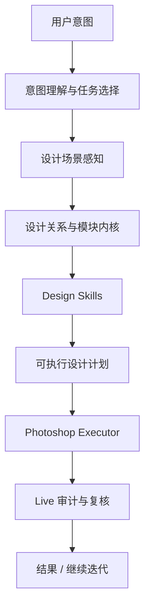

# 设计智能体研究结论与研发路线

> 文档权限：研究路线与外部借鉴总结，非当前开发真相源。
> 使用方式：只在做研究、路线对比或架构借鉴时参考，不作为当前任务入口。
> 不可覆盖：`project-memory/Prompt.md`、`project-memory/CurrentTask.md`、`docs/documentation-governance.md`、`docs/design-agent-operating-system.md`、`project-memory/Plan.md`。

## 目标

把 DesignEcho 从“能执行 Photoshop 操作的业务 Agent”，推进到“真正具备设计理解、设计规划、设计执行与复核能力的设计智能体”。

最终目标不是：

- 继续堆详情页功能
- 继续堆主图功能
- 继续堆 SKU 功能

而是：

1. 看懂当前 PSD 里的设计元素和关系
2. 看懂参考图在讲什么设计结构
3. 规划可编辑、可复核、可复用的设计动作
4. 在 Photoshop 中稳定执行
5. 保留创意空间，而不是只会套模板

## 外部研究结论

### 一类：GUI/桌面 Agent

代表项目：

- OmniParser
- UFO
- OmniMCP
- OSWorld

这些项目最值得借的是：

1. 先做结构化感知，再做动作规划
2. 把界面元素转成可推理的对象，而不是直接让模型对截图自由发挥
3. 保留 perceive-plan-act 闭环
4. 用可回放的调试产物记录每一步

这些项目不适合直接照搬的地方：

1. 它们主要针对通用 GUI，不是 Photoshop 设计场景
2. 它们很多时候只能看到截图级元素，看不到 PSD 的图层语义
3. 它们更关注“能操作成功”，不关注“设计得好不好”

对 DesignEcho 的启发：

- 不是把 Photoshop 当普通桌面软件来点按钮
- 而是利用 Photoshop 已有的图层、bounds、clipping、文本样式这些高价值结构化信息

### 二类：自动设计 / 海报 / 排版 Agent

代表方向：

- Paper2Poster / PosterAgent
- PosterCopilot
- LayoutAgent
- Design2Code
- CoGen

这些项目最值得借的是：

1. 先做内容规划，再做布局与生成
2. 把设计拆成：
   - 内容理解
   - 结构规划
   - 视觉布局
   - 输出校验
3. 多 agent 协作在复杂设计任务里是有价值的
4. “可编辑结构”比“一张看起来好看的图”更重要

这些项目不适合直接照搬的地方：

1. 很多项目的输出是 poster image、pptx、html，不是 PSD
2. 很多布局方法是从零生成，不需要考虑现有模板和现有图层
3. 很多系统对主观审美的处理还比较弱，更偏功能性布局

对 DesignEcho 的启发：

- 不能只做填模板
- 也不能只做生成图片
- 应该做“设计计划 -> PSD 动作 -> 可编辑结果”

### 三类：协作式 AI 设计系统

代表方向：

- Cocoa（co-planning / co-execution）

最值得借的是：

1. 在执行前先生成可解释的 plan
2. 人和 Agent 可以围绕 plan 协作，而不是黑盒执行
3. 局部修改和复核要比一次性黑盒生成更重要

对 DesignEcho 的启发：

- 设计智能体不能只输出结果
- 必须能解释：
  - 它理解了什么
  - 它准备怎么做
  - 为什么这样做
  - 哪一步有风险

## 对 DesignEcho 最适合的路线

不是这三种极端：

1. 纯模板填充
2. 纯 GUI 截图 Agent
3. 纯一键图像生成

最适合的是：

**Photoshop 结构感知 + 视觉分块 + 设计 skills + 可编辑执行 + 审计闭环**

## 推荐的系统架构

## 各层职责

### 1. 意图理解层

负责：

- 区分纯对话 vs 执行任务
- 判断是详情页、主图、SKU、参考迁移还是分析
- 判断当前是解释、规划、执行还是复核

问题：

- 当前仍然混有过多轻量规则
- “真实理解”还没有成为唯一真相源

目标：

- 模型主导意图理解
- 规则只做约束和纠错

### 2. 设计场景感知层

负责：

- 当前文档是什么
- 当前选中元素是什么
- 这个元素在哪
- 它所在父组、兄弟层、邻近层、剪切关系是什么

这里应统一成：

- `DesignElement`
- `SelectedDesignContext`

这层是所有设计能力的起点。

### 3. 设计关系与模块内核

负责：

- 对齐关系
- 间距关系
- 依附关系
- 主次关系
- 模块归属
- 屏边界

这里应统一成：

- `DesignRelation`
- `DesignModule`
- `DesignScreen`
- `DesignScene`

这是当前项目还没有完全做完的一层。

### 4. Design Skills

负责“怎么设计”。

不负责底层感知，不负责直接调 Photoshop。

推荐的 skills：

1. `detail-page-design`
2. `main-image-design`
3. `reference-to-design`
4. `copy-optimization`
5. `design-review`

SKU 暂时先不动。

### 5. 可执行设计计划

这是把 skill 输出变成明确动作计划的层。

每个 plan 至少要说明：

- 目标模块/目标屏
- 要改哪些元素
- 复用什么
- 新建什么
- 文案策略
- 图片策略
- 风险和验证点

### 6. Photoshop Executor

只负责动作：

- 创建元素
- 改文案
- 放图
- 排列
- 调样式
- 导出

不负责“为什么这么设计”。

### 7. Live 审计与复核

负责：

- placement audit
- copy layout audit
- visual merge audit
- before/after 真相重建

这是避免系统“做了但自己不知道做没做对”的关键。

## 当前项目的真实基础

### 已经有的

1. `selected element / module / design context`
2. `detail-page-screen-plan`
3. `detail-page-visual-segmentation`
4. `detail-page-live-placement`
5. `detail-page-copy-layout-audit`
6. Photoshop MCP host
7. UXP 结构解析和 Photoshop 原子工具

这说明：

**设计理解内核已经有雏形。**

### 还没有完全做好的

1. 统一的 scene schema
2. 参考图到设计动作规划
3. detail-page / main-image 真正建立在同一内核上
4. “创意生成 -> 复核 -> 多方案比较”闭环

## 关于“卓越效果”和“创意”的核心判断

如果目标只是“能跑”，当前系统继续加规则也能跑。

但如果目标是：

- 设计效果更好
- 更有创意
- 不是机械模板填充

那系统必须多一层：

**设计提案与评审循环**

也就是：

1. 先产出 2-3 个设计方案
2. 不急着执行全部
3. 先对方案做评审
4. 选一个更优方案再执行

这和当前“一条路跑到底”不同。

## 推荐的多 Agent 协作方式

### Agent 1：Intent Planner

负责：

- 理解用户真正想做什么
- 输出任务模式和约束

### Agent 2：Scene Analyst

负责：

- 读当前 PSD
- 建 element / relation / module / screen 上下文

### Agent 3：Design Strategist

负责：

- 根据场景和参考图提出设计方案
- 产出图文策略、层级策略、动作计划

### Agent 4：Executor

负责：

- 调 Photoshop / UXP 工具
- 按计划落地

### Agent 5：Critic

负责：

- 审核版式、文案、主次、视觉风险
- 指出不合理的地方

这才是“多 Agent 为设计服务”，而不是把多个模型堆在那里。

## 不应该走的路线

### 1. 不要继续把业务逻辑堆在 executor 里

这会让系统越来越重，也越来越不聪明。

### 2. 不要把截图 Agent 当成主方案

Photoshop 已经能给出更高质量的结构化信息：

- 图层
- bounds
- clipping
- 文本
- group

这些比纯截图更值钱。

### 3. 不要把“高风险就回退模板原文”当成长期方案

那是止损，不是设计能力。

### 4. 不要把创意等同于“随机生成一张更花的图”

对 DesignEcho，真正有价值的创意是：

- 信息组织更好
- 视觉重心更清楚
- 图文更有说服力
- 元素关系更巧妙

而不是随机风格化。

## 研发路线

### Phase 1：统一设计场景内核

目标：

- 定义并落地：
  - `DesignElement`
  - `DesignRelation`
  - `DesignModule`
  - `DesignScreen`
  - `DesignScene`

产出：

- 一套统一 scene schema
- detail-page 和 main-image 都开始依赖它

### Phase 2：让详情页和主图建立在 scene core 上

目标：

- 不再各自重复解释 PSD
- detail-page 继续 skill 化
- main-image 开始 skill 化

SKU 暂时不改。

### Phase 3：加入参考图动作规划

目标：

- 读参考图里的模块和层级
- 映射到当前 PSD
- 输出动作计划：
  - 复用
  - 新建
  - 替换
  - 调整

### Phase 4：加入设计评审循环

目标：

- 设计不只是一条 plan
- 而是 2-3 个候选 plan
- 再通过 critic 做收敛

### Phase 5：再回头收意图理解链

目标：

- 降低硬编码路由比例
- 让模型真正主导“理解用户想做什么”

## 近期最值得做的事情

优先级顺序建议：

1. 统一 scene core 类型
2. 把 main-image skill 从 executor 里拆出来
3. 做 `reference-to-design` 的 plan-only 版本
4. 做 `design-review` / critic skill

## 直接结论

如果要做成真正的设计智能体，DesignEcho 接下来不该继续沿着：

- 详情页加功能
- 主图加功能
- SKU 加功能

这条路走。

更合理的路线是：

1. 先完成设计理解内核
2. 再让详情页、主图、参考图迁移建立在内核上
3. 最后通过多 Agent 的规划、执行、评审闭环，把结果从“能跑”推进到“有创意且可控”

这条路线既适合当前项目，也最有可能把最终效果做出来。
