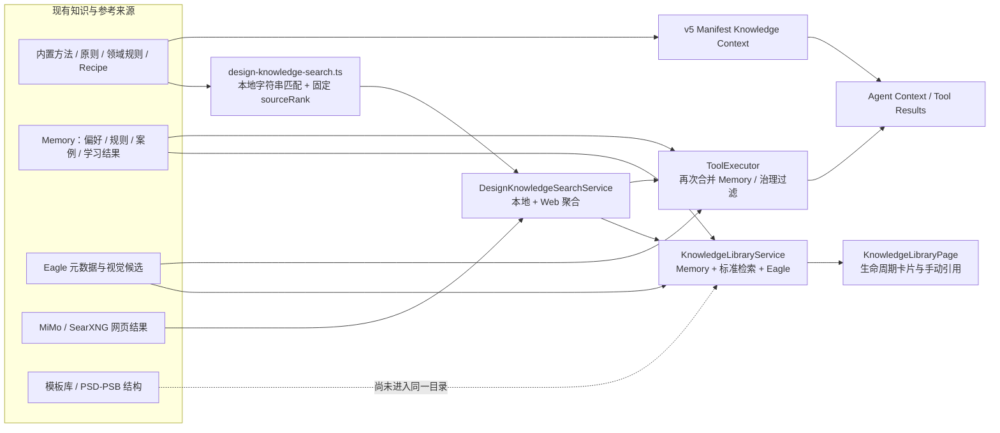
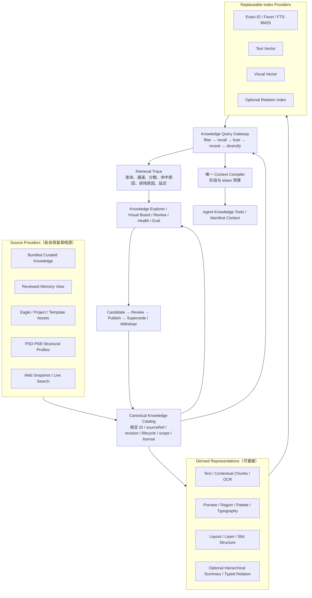

# DesignEcho 设计知识系统重构研究报告

> 文档类型：专项研究与实施建议（C 层）  
> 归属：`M4 DESIGN-KERNEL-VERTICAL-001` 前置研究  
> 日期：2026-08-01  
> 当前状态：研究结论已形成；生产 Runtime、Agent Tool、Knowledge provider 与 UI 尚未按本报告改造  
> 治理边界：本文不能覆盖 `project-memory/Prompt.md`、`project-memory/Plan.md`、`docs/design-agent-operating-system.md` 等 A 层真相源；只有在后续 `CurrentTask.md` 与 `Plan.md` 明确激活实施切片后，建议项才可进入生产代码。

## 1. 结论先行

DesignEcho 不应该把现有知识库重构成“一个更大的向量数据库”。正确目标是建设一个面向设计 Agent 的 **Design Knowledge Plane（设计知识平面）**：

- 原始知识与视觉证据有稳定身份、来源、版本、生命周期和适用边界；
- 文本、视觉、PSD/PSB 结构等多种表示并存，但都能回到原始来源；
- 词法、文本语义、视觉相似、结构过滤多路召回，经过融合与重排后再给 Agent；
- Agent 按需逐层展开，而不是每次启动都把所有方法论、历史记忆和参考图塞进上下文；
- UI 以视觉资产、证据、版本、命中原因和使用轨迹为核心，不以聊天问答或全库关系图为首页；
- 检索质量、引用正确性、生命周期过滤和最终 Photoshop outcome 都有独立评测；
- Knowledge、Project State、Memory、Observation、Recipe、Policy、Evaluation 各有唯一 owner，不能靠一个相似度分数混排权威。

对“关键词是否应保留”的明确判断是：

> **保留关键词检索，删除关键词的意图裁决权和执行路由权。**

`SKU.psb`、款号、色号、图层名、品牌名、模板 ID、规范条款等精确对象，词法检索通常比纯向量更可靠。关键词是检索信号，不是用户意图，不得据此选择 Skill、授予 Tool 权限、阻断模型或宣布任务完成。OpenAI 当前 Retrieval 文档也把稀疏关键词与 embedding 作为可调权重的混合检索通道，而不是二选一。[OpenAI Retrieval](https://developers.openai.com/api/docs/guides/retrieval)

本轮不直接接入生产 Runtime。原因不是“保守降级”，而是当前项目的实施 owner 仍是 M3-A Photoshop Transaction Runner；在 TaskRun、事务 owner 和可执行 R4 尚未收口前，提前接入新的检索与自动写回会制造第二套 Context/Memory/Runtime 责任。本文完成的是 M4 的架构准备和迁移设计，不宣称 M4 已启动。

## 2. 研究范围与方法

本次检查覆盖：

- 内置设计方法、设计原则、领域词典、文案框架、市场洞察和 Photoshop style recipes；
- `DesignKnowledgeSearchService`、SearXNG、小米联网搜索、Eagle 只读检索与视觉分析；
- `MemoryService` 中长期知识、偏好、项目规则、学习候选、版本与剔除记录；
- `DesignKnowledgeResult`、治理记录、usage snapshot、显式任务引用；
- v3 Agent 工具、v5 Manifest knowledge provider、Context snapshot 与 Design Project State 边界；
- 知识库页面、来源管理、学习复核和 Eagle 预览；
- 模板知识、PSD/PSB 结构解析和视觉案例索引；
- OpenAI、Anthropic、Google、Microsoft 官方资料及 RAG、CLIP、ColPali、RAPTOR 等原始论文。

外部资料只用于回答“成熟系统通常怎么做”；本文对 DesignEcho 的具体取舍是基于当前代码、桌面端运行方式、Photoshop/Eagle 资产形态和项目既有治理约束做出的工程推断。

## 3. 当前系统不是空白，已有值得保留的地基

### 3.1 已有统一搜索结果和生命周期治理

`src/shared/design-knowledge-search.ts` 已定义 `DesignKnowledgeQuery`、`DesignKnowledgeResult`、来源类型、用途和搜索响应；`src/shared/design-knowledge-governance.ts` 已具备：

- content fingerprint；
- source revision；
- provenance；
- lifecycle；
- retrieved / published / expires / superseded 时间；
- current / stale / withdrawn / superseded / invalid / legacy 状态；
- digest-only usage snapshot；
- “知识不授予 Tool 权限”的显式边界。

这部分方向正确，不应推倒。后续应把它从“搜索结果附属字段”提升为所有知识 provider 共用的目录治理契约。

### 3.2 已有多来源适配的雏形

`src/main/services/design-knowledge-search-service.ts` 已并行聚合：

- 本地 recipes 与手工规则；
- 小米联网搜索；
- SearXNG 网页结果。

`src/renderer/services/knowledge-library.service.ts` 又聚合：

- Memory 中的已管理长期知识；
- 统一知识检索；
- Eagle 只读知识。

这说明系统已经有 provider 聚合需求。问题不是缺少来源，而是 provider 契约、排序、权威边界和 trace 还没有统一。

### 3.3 Eagle 安全边界处理较成熟

当前 Eagle 路径已经明确：

- 搜索结果只是元数据候选，不等于 Agent 看过图；
- 需要视觉判断时必须调用视觉观察；
- 原始路径和像素不进入普通工具结果；
- UI 预览与 Agent 视觉分析使用不同目的边界；
- 搜索可按标签、文件夹、扩展名等结构化分面收敛；
- 外部不可用时如实返回状态，不伪造参考。

`src/shared/eagle-visual-case-index.ts` 也已经表达了 metadata-only、needs-visual-analysis 和视觉未知状态。这是未来视觉知识目录可以直接复用的安全模型。

### 3.4 已有知识显式引用和版本绑定

`src/shared/knowledge-selection-context.ts` 允许用户把最多 5 条当前有效知识加入本次任务，并绑定：

- result ID；
- source revision；
- content fingerprint；
- freshness；
- allowed uses；
- 有界摘要；
- 用户声明的参考用途。

`src/shared/agent-runtime-v5/operating-context-snapshot.ts` 会把这些引用放入提交时快照，并再次说明它们不能授予 Photoshop 权限或覆盖当前事实。这是“用户显式选择 + 版本绑定 + Context Compiler”的正确方向。

### 3.5 v5 已有 Kernel knowledge provider 的正确雏形

`src/shared/agent-runtime-v5/design-method-knowledge.ts` 已将通用内容策略、视觉方向、布局规划与主图、详情页、单画布、SKU overlay 建模为：

- capability ID；
- applicable Skill；
- applicable Runtime stage；
- source revision；
- objective / method / expected output / evaluation focus；
- advisory-only、无权限、无阶段推进、无质量裁决边界。

这比“每个任务启动后让模型自己去找某个方法论工具”更接近目标 Design Kernel。后续应让它成为可版本化目录 provider，而不是继续与多个重复的知识工具平行扩张。

### 3.6 当前技术栈具备设计知识处理基础

项目已经依赖：

- `ag-psd`：PSD/PSB 结构解析；
- `sharp`：预览、缩略图和区域裁剪；
- `onnxruntime-node`：本地视觉模型运行基础；
- `@xyflow/react`：关系和流程的二级可视化能力。

项目当前没有通用全文索引、BM25、向量数据库或 embedding index 依赖。这不是缺陷，而是一个重要约束：应先稳定目录和查询契约，再通过 provider 接口选择索引实现，不能为了“看起来像知识库”立即引入脆弱的 Electron 原生数据库依赖。

## 4. 当前真实架构



这张图暴露出当前核心问题：来源不少、治理也有地基，但“同一知识的身份、检索、排序、展开、引用和使用轨迹”分散在多条平行路径里。

## 5. 根因级问题清单

### P0-1：`DesignKnowledgeResult` 同时扮演搜索结果、知识条目和跨层 DTO

`DesignKnowledgeResult` 只有标题、摘要、标签、固定 sourceRank、来源和治理字段。它适合作为早期搜索卡片，却无法表达：

- 原始正文或二进制资产在哪里；
- 一个资产有哪些文本、视觉、OCR、PSD 结构等派生表示；
- 命中了哪一段、哪个区域或哪一图层；
- 为什么命中；
- 适用任务、阶段、设计维度、禁忌和反例；
- 人工审核、版权、可见范围和关系证据；
- 哪个模型生成了派生表示，是否需要重建。

结果是各来源只能把信息压进 `summary`、`sourceNotes` 和 `tags`，UI、Agent 和治理都无法获得真正统一的知识身份。

### P0-2：Memory 混合了不同权威域

`src/shared/design-memory-knowledge.ts` 的 `DesignMemoryKind` 同时包含：

- user / brand preference；
- project rule；
- approved recipe；
- rejected / failure pattern；
- visual / benchmark case。

这些对象的 owner、生命周期和使用方式不同，但进入检索后全部被投影为 `sourceType='local_case'`。即使代码里有“不授予权限”的说明，相似度或 sourceRank 仍无法判断：一条用户偏好、一条项目事实来源、一条失败经验和一条经审 recipe 谁能影响当前任务到什么程度。

必须保留 Memory Store，但不能把 Memory 当作 Canonical Knowledge Store。Memory provider 只能输出带明确类型、scope、review 状态和使用边界的候选视图。

### P0-3：知识引用角色可以越过正确 owner

当前 `KnowledgeReferenceUseRole` 包含 `product_fact`、`mandatory_rule` 和 `forbidden`。用户显式选择这些用途是有价值的交互，但它们不应该只作为一段更强的知识提示进入 Context：

- `product_fact` 应升级为有来源、待确认或已确认的 Project State fact；
- `mandatory_rule` / `forbidden` 应升级为 Project State rule record 或正式 Policy；
- 普通知识引用只能保持 `general / layout / style / color / copy` 等参考作用。

正确实现不是删除用户控制，而是把“设为事实 / 设为规则”做成显式 promotion 动作，由正确 owner 保存和复核。否则 UI 上的一次用途选择会在语义上把外部网页或 Eagle 候选变成强制规则。

### P0-4：自动 Memory 注入过宽，违反高信号上下文原则

`buildDesignMemoryKnowledgeResultsForSkill()` 把用户文本与“用户偏好、设计风格、字体、排版、颜色、配色、文案、工作流、主图、详情页、SKU”等通用词拼成查询；`matchesQueryText()` 又采用“任意 token 命中即通过”。

这会让大量只碰到一个通用词的历史记忆进入候选，随后以系统提示形式自动注入。它不是关键词意图路由，但会造成类似后果：低相关历史偏好占用上下文，并影响模型判断。

应改为：

- 只有当前 Task Semantic Binding、项目 scope 和阶段允许的 Memory 类型参与召回；
- 通用词不得作为正向相关性证据；
- 用户明确选中的知识优先；
- 自动记忆只返回极少量高置信摘要；
- no-hit 应诚实为空，不通过扩大 OR 查询制造“总能搜到”。

### P0-5：长期视觉记忆整块写入 renderer localStorage，存在真实容量与恢复风险

当前 `MemoryService` 把完整 Memory State 一次性 `JSON.stringify` 后写入 `localStorage['designecho-memory']`；设计记忆最多允许约 2000 条，而 `DesignMemoryItem.visualCase.previewDataUrl` 可以携带 base64 data URL，当前没有可靠的字节上限。

这不是“未来规模化再优化”的性能问题，而是现有存储 owner 的结构性风险：

- 少量视觉案例就可能耗尽 Chromium localStorage 配额；
- 一条大预览可导致整库保存失败；
- 整块存储没有单记录事务、原子替换、增量索引、分页和局部恢复；
- renderer 成为长期数据唯一 owner，主进程、MCP 和后台索引无法共享稳定视图；
- 项目切换、进程崩溃和数据迁移难以做可靠审计。

目标方案必须把发布后的 Catalog 元数据放到主进程唯一 Repository；Memory 仍拥有偏好和受审经验，但视觉内容只保存 content hash / artifact ref /缩略图 ref，不再保存无界 data URL。优先复用已有 Artifact Repository 或各 source provider 的资产存储，不能为此再造一个无治理的二进制仓库。

### P1-1：当前排序主要是固定 `sourceRank`，不是查询相关性

`DesignKnowledgeSearchService.limitResults()` 对不同来源结果按 `sourceRank` 排序后直接截断；本地规则、MiMo 综合摘要、网页条目、Memory 都依赖手写 rank。当前搜索没有统一的 lexical score、semantic score、visual score、rerank score 或 match reason。

尤其要避免把来源权威和查询相关性压成同一个数字：

- 生命周期与权限过滤必须先执行；
- 来源权威决定“能当什么用”；
- 检索相关性决定“与这次查询有多相关”；
- 最终多样性决定“是否给了模型重复内容”；
- 这些维度不能由一个 `sourceRank` 代替。

### P1-1A：所谓“统一搜索”在 Agent 与 UI 中含义不同

`searchDesignKnowledge` 的 Tool 描述声称结果包含本地知识、Eagle 和实时 Web；真实 Agent 执行只合并内置 /MiMo /SearXNG 与 renderer Memory，Eagle 仍是独立 `searchEagleReferences`。只有知识库 UI 的 `scope=all` 会额外调用 Eagle。

同时两条路径的去重键不同：Agent 以 `sourceType:id` 去重，UI 以 `sourceType:id:sourceRevision` 去重。结果是：

- 模型可能误以为一次搜索已经查过 Eagle；
- 用户在 UI 看见的版本集合与 Agent 实际得到的集合不同；
- provider summary 不完整；
- 后续每加一个来源都可能继续复制聚合逻辑。

必须先修正 Tool 描述与真实行为，并让 Agent 与 UI 共用唯一 Query Gateway；两者只能有不同 purpose、scope 和预算，不能有两套 merge /dedupe 真相。

### P1-2：本地检索是简单字符串包含，不是真正的全文或混合检索

recipes、领域概念、市场洞察与 Memory 当前大多通过拆词后 `includes()` 匹配。它能覆盖少量固定词，却存在：

- 中文分词和同义表达弱；
- 任意 token OR 命中带来大量误召回；
- 否定表达无法处理；
- 精确 ID 与自然语言相关性没有不同通道；
- 没有 query rewrite、字段权重、分面过滤、融合或重排。

### P1-3：Agent 面向同一知识域暴露了过多重叠工具

当前至少并存：

- `getDesignKnowledge`；
- `getMainImageDesignFramework`；
- `getDetailPageDesignFramework`；
- `getDesignPrinciples`；
- `searchDesignKnowledge`；
- `searchEagleReferences`；
- `analyzeEagleReference`；
- v5 Manifest 直接注入的 design method context。

其中几个 schema 已明确提醒模型“不要重复调用”。这说明重复不是模型问题，而是工具面设计问题。模型需要在重叠入口之间自行去重，浪费轮次和上下文。

此外还存在两层更隐蔽的可达性问题：

- Manifest `knowledge_refs` 被 capability resolver 标记为 resolved，只说明 provider identity 可追溯，不等于正文已加载，也不会自动让对应 Tool schema 可见；
- R1/R3 阶段把一个过粗的 `knowledge.read.designFoundation` 映射到多个不同工具，再从当前可执行 provider 中选择第一个，导致 `searchDesignKnowledge` 可能依赖另一个 capability “顺带激活”，通用设计 Manifest 的动态知识搜索并没有稳定直接的可达链。

未来 Capability Session 和 UI 必须把 `identity_resolved`、`content_loaded`、`tool_available`、`context_selected` 分开显示，不能用一个“已解析”状态让人误以为知识已进入 Agent。

### P1-3A：已有 stage 元数据，但方法正文没有真正按阶段装载

v5 `DesignMethodKnowledgeDefinition` 已声明 `applicableStages`，但当前 builder 只接收 `knowledgeRefs + manifestSkillId`，没有接收当前 stage；Autonomous Agent 又在启动前一次性装载方法上下文，并额外常驻一份 Design Principles。

后果是：

- R3 策略方法和 R4 布局方法可能在任务开始时一起进入上下文；
- Manifest overlay、常驻 Principles、`getDesignPrinciples` 和品类 Framework Tool 重复；
- 版本与 token 使用容易漂移。

不能新建第二 Context Compiler。正确修复是让统一 Knowledge Context Provider 输出带 `stages`、trust、freshness、priority、conflictKey 和 budget cost 的 `RuntimeContextItem`，继续交给现有 `runtime-context-compiler.ts`。

### P1-4：视觉知识尚未成为一等可检索对象

Eagle 能检索元数据、临时预览并按条目做视觉分析；PSD/PSB 也已有结构解析能力，但系统还没有统一表达：

- 整图与区域；
- OCR 与文案；
- 配色与字体；
- 版式角色、对齐、主体占比和信息层级；
- PSD 画板 /分区 /图层组 /图层；
- 文本向量与视觉向量；
- 命中区域和视觉 match reason。

因此当前“设计知识库”本质上仍是文本卡片加按需图片预览，不是多模态设计知识系统。

### P1-5：模板知识是大型独立资产系统，但没有进入统一目录

`src/main/services/template-knowledge.service.ts` 已超过 3000 行，拥有模板、库目录、预览、导入、标签、查询、回收与恢复等完整资产责任。它不应该被复制进新知识库，但应作为 `template / psd_structure` provider 接入统一 Catalog，让 Agent 和 UI 能用同一稳定 ID、版本与来源查看模板知识。

### P1-6：UI 已有生命周期管理，但不是真正的设计知识浏览器

`KnowledgeLibraryPage` 目前的优势是：

- 来源筛选；
- current / review / disabled / superseded / expired；
- 修订、剔除、恢复；
- Eagle 临时预览和视觉理解；
- 显式加入本次任务。

缺失的是：

- 默认图片网格或瀑布流；
- 设计维度、任务类型、品牌、品类、阶段、版权等 facets；
- 单资产的原图、区域、OCR、字体、配色、PSD 结构联合视图；
- “为什么命中”的检索 trace；
- 查询改写、各召回通道、融合和重排结果；
- 知识覆盖、失效、重复、缺少审核和待重建索引的健康面板；
- 可回归比较的 Eval 面板。

### P1-7：没有独立的检索质量基线与回归闸门

当前治理能判断版本是否可用，却不能判断“搜得准不准”。没有版本化 golden query set、目标结果、Recall@K、Precision@K、NDCG@K、视觉区域命中率、引用正确率或 Agent 检索行为评测。

因此调整关键词、sourceRank、provider 顺序或提示后，只能凭演示感觉判断效果。OpenAI 当前明确把这种 “vibe-based eval” 列为反模式；Google Agent Search 也用固定 query set 和 Recall、Precision、NDCG 比较不同配置。[OpenAI Evaluation best practices](https://developers.openai.com/api/docs/guides/evaluation-best-practices) [Google Evaluate search quality](https://docs.cloud.google.com/generative-ai-app-builder/docs/evaluate-search-quality)

### P1-8：Project State 仍有未经同等级治理的知识污染旁路

Project State 的 `factRecords` / `ruleRecords` 有较好的来源与确认治理，但 legacy `patch.set` 仍允许直接写 `productFacts`、`sellingPoints`、`painPoints`、`competitorNotes`；`appendLearning` 也只是无来源、无 review 状态的自由文本，后续会作为历史复盘自动注入。

这不是要求把 Project State 并入知识库。相反，应在知识重构前封住旁路：

- 新事实只写 fact records；
- 新规则只写 rule records；
- `appendLearning` 降为待复核 reflection /experience candidate；
- Catalog 只通过受控 provider 读取已确认事实或已复核经验的 view，不复制它们成为第二真相。

### P1-9：本次任务引用缺少 task /project 生命周期绑定

`KnowledgeSelectionReference` 当前保存在 Workbench React state；提交时会冻结进请求，但项目或页面切换没有同等明确的清理 /重新校验，发送完成后也不会自动结束“本次任务”引用。用户忘记移除时，旧项目或旧任务选择可能继续进入后续请求。

后续引用必须绑定 `taskRunId`、`projectId`、`selectedAt` 与 scope revision；项目 /TaskRun 切换时重新验证或清空。是否在同一 TaskRun 多轮复用由 TaskRun owner 决定，不由长寿命页面 state 猜测。

### P1-10：网页抓取旁路没有完整进入知识治理

`fetchWebPageDesignContent` 与 `searchDesigns` 仍可直接把网页正文 /图片或爬虫结果回给 Agent，但没有统一的 source revision、TTL、allowed use、disposition 和 usage snapshot。它们要么变成 Web provider 的受治理结果，要么只能作为临时外部观察，不能被描述为正式知识依据。

## 6. 外部最佳实践及 DesignEcho 取舍

### 6.1 Agent 知识系统首先是 Context Engineering

Anthropic 的最新 Agent context engineering 建议把上下文视为有限资源，使用轻量标识、路径和元数据，Agent 再通过工具 just-in-time 展开，并以 progressive disclosure 逐层发现信息。[Anthropic Context Engineering](https://www.anthropic.com/engineering/effective-context-engineering-for-ai-agents)

对 DesignEcho 的落地不是“全部改成 Agentic RAG”，而是混合策略：

- Manifest 明确激活且体积小的 Design Kernel 方法，可在对应阶段提前注入；
- 动态参考、案例、外部趋势、PSD 结构和长期记忆按需检索；
- 首次搜索只给紧凑 Evidence Card；
- 只有 Agent 或用户选中后才展开全文、高清图、视觉区域或图层结构。

### 6.2 混合检索优于单独向量检索

OpenAI File Search 同时使用语义与关键词搜索；Retrieval API 支持 query rewrite、attribute filters、score threshold、ranker 和基于 RRF 的 sparse / embedding 权重。[OpenAI File Search](https://developers.openai.com/api/docs/guides/tools-file-search) [OpenAI Retrieval](https://developers.openai.com/api/docs/guides/retrieval)

Anthropic 的 Contextual Retrieval 同样把 BM25 与 embedding 并行召回、rank fusion 和 reranking 作为组合方案；其公开实验中的提升是该测试集上的相对结果，不能直接当成 DesignEcho 承诺，但方向值得采用。[Anthropic Contextual Retrieval](https://www.anthropic.com/engineering/contextual-retrieval)

DesignEcho 推荐的默认检索链是：

```text
Agent 给出查询与目的
  → 确定性 scope / lifecycle / visibility / allowed-use 过滤
  → 精确标识解析
  → 词法召回 + 文本语义召回 + 视觉召回并行
  → Reciprocal Rank Fusion
  → 领域重排
  → 来源与内容去重 /多样性控制
  → Context Compiler 按 token 预算选取
  → Evidence Card + Retrieval Trace
```

注意：打开 `SKU.psb` 仍属于 Project Resource / Photoshop navigation，不属于知识检索。它与知识库都应保留词法能力，但不能为了统一搜索而把资源导航、知识、项目事实和执行工具混成一个 index。

### 6.3 分块必须保留设计语境

固定 token 分块不适合设计知识。建议按内容形态切分：

| 来源 | 推荐语义边界 |
|---|---|
| 方法论 | 章节 → 原则 → 适用条件 → 反例 → 验收标准 |
| 品牌规范 | 品牌层 → 渠道 → 资产类型 → 规则条款 |
| PSD/PSB | 文档 → 画板/分区 → 图层组 → 图层/文字样式 |
| 详情页 | 页面 → 屏/业务模块 → 信息角色 → 视觉区域 |
| 参考图 | 整图 → 产品主体 /文字 /背景 /装饰区域 |
| 模板 | 模板 → 槽位/区域 → 可替换对象 → 约束 |
| 历史案例 | 目标 → 输入 → 决策 → 成品 → 评审 → 缺陷 |

每个 chunk / region 必须带父级语境、原始 source ref、版本、任务适用范围、证据状态和派生模型版本。摘要或 caption 只能是派生表示，不能替代原始证据。

### 6.4 设计知识必须原生多模态

Google 提供图像、文本和视频共同 embedding 的官方能力；CLIP 论文证明自然语言与图像可以形成可比较表示；ColPali 进一步展示了直接对视觉丰富页面生成多向量表示、保留布局与字体等视觉线索的路线。[Google Multimodal Embeddings](https://docs.cloud.google.com/vertex-ai/generative-ai/docs/samples/generativeaionvertexai-multimodal-embedding-image-video-text) [CLIP](https://arxiv.org/abs/2103.00020) [ColPali](https://arxiv.org/abs/2407.01449)

对 DesignEcho 的实际判断：

- 第一阶段用结构化标签、OCR、视觉摘要和单向量召回即可建立 baseline；
- 不要一开始部署高成本 late-interaction 索引；
- Caption 不能替代原图和区域表示；
- PSD/PSB 比普通页面更结构化，应同时保留合成视觉与 Photoshop 图层结构；
- 是否需要 ColPali 类细粒度检索，必须由视觉检索 Eval 证明，而不是由技术新颖度决定。

### 6.5 GraphRAG 不适合作为第一期主链

Microsoft GraphRAG 把 Local、Global、DRIFT Search 用于不同问题，且明确说明 Global Search 是资源密集的全局 map-reduce 查询。[Microsoft GraphRAG Query Overview](https://microsoft.github.io/graphrag/query/overview/)

适合后续 GraphRAG 的问题：

- “近三个月高评分主图共同用了哪些视觉策略？”
- “某品牌配色、字体、构图和文案语气有哪些稳定关系？”
- “哪个设计原则在哪些项目中被验证或推翻？”

不适合 GraphRAG 的问题：

- 找到一个模板或文件；
- 查询一条规范；
- 找相似构图参考；
- 普通设计任务每次启动；
- Photoshop 当前文档事实。

结论：第一期只保留有证据的 typed relations，并在 UI 中做选中资产的局部关系视图；只有普通混合检索无法满足跨案例全局问题且 Eval 有明确收益时，才引入图谱索引。

### 6.6 层级摘要只适合长知识，不是事实源

RAPTOR 用递归聚类与摘要建立不同抽象层级，适合方法论、品牌规范和大型复盘的整体问题。[RAPTOR](https://arxiv.org/abs/2401.18059)

它不适合替代当前 Photoshop 状态、Project State、文件路径、权限或高频变化事实。所有摘要节点都必须指回原始证据，并随来源版本失效。

## 7. 必须分开的权威域

| 信息类型 | 唯一 owner | 可进入知识查询吗 | 是否可直接约束执行 |
|---|---|---:|---:|
| Canonical Design Knowledge | Knowledge Catalog + 原来源 provider | 是 | 只能按 allowed use 提供方法、参考或 recipe clue |
| Project Facts / Confirmed Rules | Design Project State | 只可作为 scope /filter 或显式上下文，不作为普通知识混排 | 已确认记录可影响当前任务；不授予 Tool 权限 |
| User / Brand Preferences | Memory | 可作为带 scope 的低优先候选 | 不能覆盖当前用户指令、项目事实或视觉观察 |
| Reviewed Experience | Memory / M7 promotion workflow | 可作为 reviewed case | 只能参考；晋升 recipe /knowledge 需独立发布 |
| Visual References | Eagle / Project Asset / Template source | 是，以 source ref 与派生表示检索 | 不能证明商品事实；必须先真实观察再作视觉断言 |
| Photoshop Craft Recipe | Design Kernel Knowledge provider | 是，按任务与 stage 激活 | 只描述意图到操作的专业方法；真实执行仍走 Capability /Preflight /TransactionRunner |
| Runtime Observation | TaskRun Context / Observation owner | 否，不进入长期知识索引 | 当前、可验证的观察优先于历史知识 |
| Policy / Permission | Capability Registry / Preflight / Release Gate | 否 | 是唯一确定性执行边界之一 |
| Evaluation Rubric / Result | Evaluation owner | rubric 可作为知识引用；result 不作为知识真相 | 质量裁决由唯一 Release Gate 消费 |

最重要的不变量：**可以有一个统一查询入口，但不能有一个统一权威池。**

## 8. 目标架构：Design Knowledge Plane



### 8.1 Catalog 是目录，不是新的大文件仓库

建议 Catalog 只保存稳定元数据、source ref、hash、版本、生命周期和派生表示引用：

- Eagle 原图继续留在 Eagle；
- 项目素材继续留在项目；
- 模板二进制继续由 Template Library 管理；
- 内置方法正文继续受源码和版本控制管理；
- Memory 条目继续由 Memory Store 管理；
- Web 内容保存受 TTL 和来源治理的 snapshot ref。

禁止把所有二进制复制到一个新数据库，禁止创建第二 Artifact Store 或第二 Memory Store。

Catalog 的 canonical metadata owner 应是主进程内唯一的 `CatalogRepository`，renderer 只通过 IPC / Query Gateway 读取和提交受控变更，不能继续由页面 state 或 `localStorage` 充当正式知识真相源。各 provider 仍拥有自己的正文和二进制；Repository 只维护可审计目录、发布状态和派生表示引用。这样 Electron 主进程、Agent、MCP、后台索引和 UI 才能看到同一版本视图，同时避免把 Eagle、模板库、项目素材和 Memory 再复制一遍。

### 8.2 Catalog 与索引必须解耦

Catalog 是可审计真相；FTS、embedding、视觉向量、关系图都是可重建派生索引。更换模型或索引引擎时，不得改变知识身份、来源和审核状态。

由于当前 Electron 28 / Node 运行线没有现成 SQLite 或向量依赖，建议：

1. 先定义 `KnowledgeIndexProvider`；
2. K1 用确定性内存索引 / provider 原生搜索建立 baseline；
3. 对 SQLite FTS5、WASM 索引或独立 sidecar 做 packaging spike；
4. 只有通过 `npm run pack`、Windows 安装包、中文分词、并发读和索引恢复验证后，才选默认本地实现；
5. OpenAI File Search、Google 或外部向量库只能作为可选 provider adapter，不能成为核心数据模型。

## 9. 建议的最小数据契约

以下是实施时应建立的概念契约。字段可在 M4 切片中进一步收敛，本轮不直接写入 Runtime。

### 9.1 `DesignKnowledgeAssetRecord/v1`

```ts
interface DesignKnowledgeAssetRecord {
    version: 'design-knowledge-asset/v1';
    assetId: string;
    kind: 'principle' | 'method' | 'recipe' | 'visual_case' | 'template_profile'
        | 'psd_structure' | 'platform_spec' | 'brand_guideline' | 'market_research';
    title: string;
    sourceRef: {
        providerId: string;
        opaqueId: string;
        sourceRevision: string;
        contentFingerprint: string;
    };
    governance: DesignKnowledgeGovernanceRecord;
    reviewStatus: 'candidate' | 'reviewed' | 'authoritative' | 'deprecated';
    scope: {
        visibility: 'global' | 'user' | 'brand' | 'project';
        scopeId?: string;
    };
    applicability: {
        taskProfileIds: string[];
        stages: string[];
        designDimensions: Array<'content' | 'layout' | 'style' | 'color' | 'typography' | 'craft'>;
        suitableWhen: string[];
        avoidWhen: string[];
    };
    allowedUses: DesignKnowledgeAllowedUse[];
    representationRefs: string[];
    relationRefs: string[];
    license?: string;
    createdAt: string;
    updatedAt: string;
}
```

关键约束：

- 不引入一个跨域的数值 `authorityScore`；reviewStatus、provenance、freshness、scope 与 allowedUses 分别判断；
- 相关性分数属于一次 Retrieval Trace，不写回 Asset；
- Project fact、Tool permission、Runtime observation 不允许伪装成该契约。

### 9.2 `DesignKnowledgeRepresentation/v1`

同一资产可拥有：

- `text_body_ref`；
- `contextual_chunk`；
- `ocr`；
- `caption`；
- `visual_preview`；
- `visual_region`；
- `palette`；
- `typography_profile`；
- `layout_structure`；
- `photoshop_layer_structure`；
- `text_embedding`；
- `visual_embedding`；
- `hierarchical_summary`。

每个派生表示必须记录：

- parent asset / parent region；
- source revision；
- generator provider / model / version；
- generatedAt；
- region bounds 或 layer identity；
- human confirmation；
- stale / rebuild 状态。

### 9.3 `DesignKnowledgeEvidenceCard/v1`

首次检索返回紧凑卡片，不返回全部正文：

```ts
interface DesignKnowledgeEvidenceCard {
    version: 'design-knowledge-evidence-card/v1';
    evidenceId: string;
    assetId: string;
    title: string;
    kind: string;
    snippet: string;
    thumbnailRef?: string;
    matchedRegion?: { representationId: string; bounds?: [number, number, number, number] };
    matchReasons: string[];
    source: { providerId: string; sourceRevision: string; citation: string };
    freshness: DesignKnowledgeFreshness;
    reviewStatus: string;
    allowedUses: DesignKnowledgeAllowedUse[];
    scores: {
        lexical?: number;
        semantic?: number;
        visual?: number;
        rerank?: number;
        fused?: number;
    };
}
```

Evidence Card 是查询响应，不是新的通用 Evidence Store。

### 9.4 `DesignKnowledgeRetrievalTrace/v1`

每次查询至少记录：

- 原始 query、可选 query rewrite 与 caller purpose；
- Task Semantic Binding ref、stage、project /brand scope；
- provider 与 index 版本；
- 各召回通道的候选数、延迟和错误；
- filter /exclude 原因；
- fusion、rerank 与最终选择；
- Context Compiler 选入和未选入原因；
- source revision /content fingerprint；
- token /image observation 预算。

对于 Manifest knowledge refs，还必须分别记录四个状态：`identity_resolved`、`content_loaded`、`tool_available`、`context_selected`。前一个状态只证明 provider identity 可追溯，不能被 UI 或日志简化成“知识已生效”。

Trace 供 UI、Run Record 和 Eval 使用，不保存模型私有思维链，不授予权限，也不等同质量证据。

## 10. 检索与 Context 策略

### 10.1 Agent 决定“何时查、查什么”，Gateway 决定“如何安全地查”

开放式问题交给模型：

- 是否需要参考；
- 查询如何表达；
- 要展开哪条证据；
- 哪些方法适合当前设计。

确定性边界留在系统：

- scope、权限、生命周期、allowed use；
- exact identity；
- provider 超时和错误；
- 多路召回、融合、重排和 token 预算；
- source /revision /citation；
- 知识不能扩大 Tool 权限；
- 外部内容只能作为 data。

这与项目“有唯一正确答案走确定性约束，没有唯一答案交给模型”的架构原则一致。

### 10.2 两阶段或三阶段工具面

长期建议把 Agent 工具收敛为：

1. `searchDesignKnowledge`：返回 L0/L1 Evidence Cards；
2. `getDesignKnowledgeItem`：按稳定 ID 展开正文、结构化特征和关系；
3. `observeDesignKnowledgeVisual`：只对明确选中的视觉证据加载图像 /区域；
4. `recordDesignKnowledgeFeedback`：写入隔离反馈队列，M7 前不开放自动 canonical promotion。

迁移策略：

- 不在同一提交里硬删现有工具；
- `getMainImageDesignFramework`、`getDetailPageDesignFramework`、`getDesignPrinciples` 先转为 Catalog provider /兼容 alias；
- Manifest 激活的方法论通过统一 provider identity 进入 Context；
- `searchEagleReferences` 和 `analyzeEagleReference` 的安全实现可作为 Gateway 的 source-specific provider 与 visual resolver；
- Agent Tool surface 最终只保留不重叠的搜索、展开、观察三种读操作。

### 10.3 渐进披露层级

| 层级 | 内容 | 默认进入模型吗 |
|---|---|---:|
| L0 | ID、标题、类型、来源、缩略图、freshness | 搜索时是 |
| L1 | 摘要、命中原因、标签、适用 /避免场景 | Top 结果是 |
| L2 | 结构化设计特征、方法步骤、PSD 结构摘要 | 选中后 |
| L3 | 原始正文、高清图、视觉区域、完整图层结构 | 明确需要时 |
| L4 | 跨案例关系、层级摘要、全库聚合 | 专门全局查询时 |

不要把固定 Top 5、Top 8 或某个 chunk 数量写成永恒规则。初始值可以保守设定，但必须由真实 query set、模型上下文预算和最终任务 Eval 调优。

### 10.4 阶段感知但不做关键词路由

知识选择应依赖已绑定的 Task Profile、Manifest 和 Runtime stage，而不是从用户文本正则猜阶段。例如：

- R3 可激活内容策略、视觉方向、品牌方法和经观察的参考；
- R4 可激活布局规划与 Photoshop Craft Recipe；
- 评审阶段可读取 rubric、参考版本和设计决策来源；
- 运行观察与 Photoshop 事实始终来自当前 TaskRun，不从知识库召回。

未绑定任务类型时，由通用 Design Kernel 提供小而稳定的共同知识，模型可再按需查询；不得退回关键词前置分类。

## 11. 面向设计工作的可视化信息架构

可视化的目标不是“做一张很炫的知识图谱”，而是让设计师和 Agent 都看见：有什么、为什么命中、能当什么用、原始证据在哪里、是否过期、是否真的被使用。

### 11.1 总览 Dashboard

展示：

- 各 provider 状态与最近同步；
- current / stale / review / superseded / withdrawn；
- Task Profile × Design Dimension 覆盖热力图；
- 缺少预览、版权、审核、结构解析或 embedding 的资产；
- 待复核候选与待重建表示；
- 最近检索失败与无结果查询。

### 11.2 Knowledge Explorer

主视图按内容形态切换：

- 视觉案例：图片网格 /瀑布流；
- 方法与原则：结构化列表；
- Recipe：步骤与适用条件卡片；
- 模板 /PSD：预览 +结构树；
- 外部研究：来源、摘要、TTL 与引用卡片。

左侧 facets：来源、知识类型、Task Profile、设计维度、品类、品牌、阶段、审核、freshness、版权和 scope。右侧 Inspector 展开版本、原始来源、派生表示与历史使用。

### 11.3 Task × Stage Matrix

这是设计 Agent 知识可视化中比“全库知识图谱”更重要的一张运营视图。横轴展示 Task Profile（通用单画布、主图、SKU、详情页及后续任务），纵轴展示 Runtime stage /设计维度；每个单元格显示：

- 已绑定但尚未加载的 knowledge refs；
- 当前可用、缺失、过期、待审核和冲突的资产；
- `identity_resolved / content_loaded / tool_available / context_selected` 四态；
- 预计 token /视觉观察预算；
- 最近真实 TaskRun 的命中、引用和 outcome 反馈。

它回答“Agent 在这个阶段到底掌握了什么”，也能直接暴露当前 `applicableStages` 已声明但正文仍提前整包加载的问题。矩阵只投影 Manifest、Capability Session、Catalog 与 Retrieval Trace 的事实，不能自己成为第二调度器。

### 11.4 Visual Case Board

每个案例同时呈现：

- 原图 /缩略图；
- 产品主体、文字、背景、装饰等区域；
- OCR 与文案；
- 色板、字体、构图、对齐、层级和主体占比；
- PSD/PSB 图层结构（如存在）；
- 适用场景、避免场景、局限；
- 人工审核与采用 /拒绝反馈；
- “学习手法，不复制内容”的边界。

第一期可以用区域框、结构命中和字段高亮解释视觉结果；只有 Eval 证明有价值时再上 query-token /image-patch 热力图。

### 11.5 Recipe Canvas

Recipe 不是固定 Workflow DAG。建议可视化为：

```text
适用条件 → 所需观察 → 设计意图 → Craft 方法 → 可用原子能力 → 写后验证 → 失败/禁忌
```

它帮助设计师检查 recipe 是否可用，但不直接推进 Runtime stage，也不绕过 TransactionRunner。

### 11.6 Retrieval Trace

展示：

- Agent 原始查询和 query rewrite；
- 启用的 provider /检索通道；
- 各通道候选数量、延迟和错误；
- 词法、语义、视觉命中原因；
- fusion 与 rerank 顺序；
- 哪些结果因 scope、freshness、review 或重复被排除；
- 哪些证据最终进入 Context；
- token /视觉观察预算。

这不是展示思维链，而是展示系统可观察事实。

### 11.7 关系图只做二级视图

使用现有 `@xyflow/react` 可以构建选中资产的局部关系：

- 原始来源 → 派生表示；
- 参考图 → 版式模式 /设计原则；
- Recipe → 所需观察 /原子能力 /验证；
- 方法版本 → supersedes；
- 案例 → 评审 /修订 /最终版本。

全库 GraphRAG 网络图不应作为首页，因为高密度关系图通常不利于日常找参考和判断证据。

### 11.8 Review 与 Publication Inbox

复核界面必须让用户看见：

- 候选来自哪个 TaskRun、来源和 revision；
- 原始成品与质量 /执行证据；
- 模型提炼了什么；
- 哪些字段是观察，哪些是推断；
- 适用和不适用范围；
- 接受、修改、拒绝、合并、替代的结果。

不能只让用户点“采纳”，更不能因调用次数或模型自评自动晋升。

## 12. 写入、审核、发布与失效

推荐生命周期：

```text
raw source
  → indexed candidate
  → human / benchmark reviewed
  → authoritative or reviewed
  → superseded / withdrawn / deprecated
```

规则：

1. TaskRun 只可产生隔离的 ExperienceCandidate 或反馈，不可直接改 canonical Knowledge；
2. failed /cancelled /unverified TaskRun 只能产生缺陷候选，不能产生“成功 recipe”；
3. 用户明确确认的项目事实写入 Project State，不写入通用知识；
4. 用户偏好写入 Memory，并保留 scope；
5. reviewed experience 若要晋升为 method /recipe，必须新建版本、绑定来源、跑检索和真实任务 canary，并支持 rollback；
6. 来源更新、删除或撤回时，Catalog 必须把所有 chunk、embedding、区域和 relation 标为 stale /rebuild /withdrawn；
7. 摘要不得覆盖原始正文，caption 不得覆盖原图，图谱关系不得失去 sourceEvidenceRefs；
8. 读工具和写回工具严格分离。

## 13. 推荐实施路线

### K0：本轮——研究、边界与迁移设计

已完成：

- 现状审计；
- 外部一手实践研究；
- 目标架构、契约、UI、检索和发布建议；
- M4 前置报告与项目记忆登记。

未完成：任何生产 Runtime 或索引实现。

### K1：只读 Catalog 与 provider 统一

前置：M3 当前 owner 允许进入 M4 实施。

实施：

- 新增最小 `DesignKnowledgeAssetRecord`、provider 和 query response 契约；
- 新增主进程唯一 `CatalogRepository`；renderer 与 Agent 都只做薄客户端，不各自维护 merge /dedupe 真相；
- 将 bundled、Memory view、Eagle、Web、Template /PSD 接成只读 provider；
- Catalog 只保存 source ref 与治理元数据，不复制大文件；
- 现有 `DesignKnowledgeResult` 作为兼容投影；
- 为每个结果补齐 stable ID、revision、fingerprint、scope、review 与 allowed use；
- 先修正 `searchDesignKnowledge` 对 Eagle 覆盖范围的错误描述，并统一 Agent /UI 的 provider summary 与去重规则；
- 增加一次性、可回滚、幂等的 renderer `localStorage` 迁移读取器：偏好和受审经验仍进入 Memory owner，可发布知识进入候选队列；`previewDataUrl` 先提取为 artifact /thumbnail ref，再写引用，原数据在校验完成前不删除；
- 记录 `identity_resolved / content_loaded / tool_available / context_selected`，不再用单一 resolved 状态误报生效；
- 不改 Agent 行为，只增加 Catalog 和 Retrieval Trace shadow 记录。

退出条件：

- 所有进入 UI /Agent 的知识结果 100% 有稳定来源、revision 和 lifecycle；
- cross-project /brand scope 泄漏为 0；
- withdrawn /superseded /invalid 进入 planning 为 0；
- renderer `localStorage` 不再是 canonical knowledge owner，发布记录中无无界 base64 data URL；
- 现有工具输出无破坏性变化。

### K2：可视化 Explorer + 精确 /词法 baseline

实施：

- Knowledge Explorer、Visual Case Board、Inspector、Health；
- Task × Stage Matrix；
- exact identity、字段过滤和 FTS/BM25 provider；
- 版本化真实 query set；
- Retrieval Trace 与“为什么命中”；
- Catalog 与 UI 共享同一数据，不维护第二份前端状态真相。

索引引擎先做 packaging spike；不因报告直接添加 native SQLite 依赖。

退出条件：

- 精确 ID /条款查询在 golden set 中稳定命中；
- query-level Recall、Precision、NDCG 有 baseline；
- UI 可定位原始来源和排除原因；
- `npm run pack` 与 Windows 安装包验证通过。

### K3：文本混合检索与渐进披露

实施：

- contextual chunks；
- 文本 embedding provider；
- BM25 + embedding RRF；
- domain rerank 与多样性控制；
- `search → get item` 两阶段 Agent 工具；
- Context Compiler stage /token budget；
- 现有重复知识工具进入兼容迁移。

退出条件：

- 相比 K2 baseline，真实 query set 的排序质量有可重复提升；
- 上下文 token 不增加且任务正确性不退化；
- 每条模型引用可追溯到 asset /representation /revision；
- 不必要检索与应检索未检索都有可观察指标。

### K4：设计多模态索引

实施：

- Eagle /项目 /模板统一视觉 source refs；
- 缩略图、区域裁剪、OCR、色板、字体、布局和 PSD 结构表示；
- 文搜图、图搜图和结构过滤；
- visual embedding provider；
- matched region 与视觉 match reason；
- 第一条真实纵切优先选择“无业务 Skill 的通用单画布设计”，对齐项目 M4 顺序。

退出条件：

- 视觉 golden set 有区域 /资产级人工标注；
- 文找图和相似构图的 human pairwise relevance 优于纯标签 baseline；
- Agent 只有观察过视觉证据后才能声明视觉特征；
- 真实 Photoshop outcome 与无知识 baseline 分开比较。

### K5：Recipe 与 Design Kernel 收口

实施：

- Manifest knowledge refs 指向统一 provider identity；
- Photoshop Craft Recipe 使用版本化知识契约；
- specialized framework tools 迁移为兼容 alias 后逐步退役；
- 单一 Context Compiler 消费 Manifest、动态检索和用户显式引用；
- Recipe 只提供专业方法，不拥有执行和质量裁决。

退出条件：

- Agent 工具面没有重复方法论入口；
- 无业务 Skill 通用单画布纵切能从 grounded knowledge 到可编辑 Photoshop 结果，并有同目标读回；
- Knowledge、Capability、TransactionRunner、Evaluation 和 Release owner 无交叉授权。

### K6：M7 受审演进

实施：

- ExperienceCandidate；
- review /publish /canary /rollback；
- recipe、method、visual case 分类型晋升；
- 真实采纳、拒绝、结果质量和任务效率指标。

在 M7 前，不开放模型自动改写 canonical knowledge。

## 14. 最小可交付纵切

推荐的第一条知识系统纵切不是“把所有 Eagle 图片向量化”，而是：

> **无业务 Skill 的通用单画布设计知识纵切。**

范围：

1. Catalog 接入三份通用 Kernel 方法：内容策略、视觉方向、布局规划；
2. 接入一组内置设计原则；
3. 接入少量已审核 Eagle 视觉案例，保留原图引用、元数据和真实视觉观察；
4. 接入一个 PSD/PSB 结构档案；
5. UI 能按 layout /style /color /typography 浏览与显式引用；
6. Agent 搜索只拿 Evidence Cards，选中后再展开；
7. Retrieval Trace 记录为何选入；
8. Agent 在 Photoshop 中完成一个海报 /社媒封面 /Banner，并由当前 Runtime owner 做真实写入和读回；
9. 检索质量、Agent 行为、Photoshop outcome 分层验收。

这条纵切同时验证 Design Kernel、视觉参考、PSD 结构、Context Compiler 和真实设计结果，又不把主图、详情页或 SKU 专属分支写进通用 Agent。

## 15. Eval 与验收指标

### 15.1 数据与治理

- stable ID /source revision /fingerprint 完整率；
- current /stale /withdrawn 过滤正确率；
- cross-user /project /brand scope 泄漏数；
- 原始来源可访问率；
- 派生表示 stale /rebuild 检出率；
- 引用与原文一致性；
- prompt injection 数据被错误提升为 instruction 的次数。

这些确定性指标应接近或达到 100% 正确；不能由模型评分替代。

### 15.2 检索

- Recall@K；
- Precision@K；
- NDCG@K；
- exact identifier /条款命中；
- no-hit 正确率；
- source diversity；
- 视觉资产与区域 Recall；
- rerank 相对 baseline 的增益；
- 平均 /P95 延迟；
- Context token 与视觉观察预算。

不先拍一个漂亮绝对阈值。K2 建立真实 baseline，后续每个索引、模型、chunk 或 rerank 变更必须在同一 query set 上比较，并设置非退化闸门。

### 15.3 Agent 行为

- 需要知识时是否检索；
- 不需要时是否浪费检索；
- 是否重复调用兼容工具；
- 是否展开了真正需要的证据；
- 是否把参考当商品事实；
- 是否引用过期或未观察视觉；
- 是否让知识扩大 Tool 权限；
- 是否能在 no-hit 时诚实继续、换源或询问，而不是伪造。

### 15.4 最终设计结果

- 真实 Photoshop 文档是否发生目标写入；
- 是否保持可编辑结构；
- 是否按同目标读回；
- 设计决策与引用是否可追溯；
- critic /人工 pairwise 是否优于无知识 baseline；
- 任务完成率、修改轮次、平均耗时和失败类型。

Agent 说“我参考了知识库”不算成功，Tool success 也不等于设计质量通过。

## 16. 安全与治理

- 所有 Web、Eagle、项目文件、历史对话和子 Agent 结果都作为外部 data，不作为 system instruction；
- 知识搜索默认只读；写回是独立 capability；
- 资产必须按项目、用户、品牌、保密级别、版权和 allowed use 先过滤；
- Prompt injection 不能扩大 Photoshop、文件、网络或发布权限；
- 原始证据永远保留，摘要和关系可重建；
- 失效源必须级联失效其 chunk、embedding、summary 和 relation；
- Trace 不保存私有思维链；
- 用户显式“设为事实 /设为规则”必须进入正确 owner，不靠引用角色偷偷升级；
- 不可逆动作仍由执行和 Release 边界确认，Knowledge 不承担安全 gate。

## 17. 明确不推荐的路线

- 不把 Knowledge、Memory、Project State、Policy、Observation 放进同一向量集合；
- 不删除关键词检索；删除的是关键词的意图和执行权；
- 不把每张图压成一句 caption 后丢掉原图和区域；
- 不在每次 Agent 运行前自动注入全部方法论和历史记忆；
- 不让一个固定 `sourceRank` 同时代表权威、相关性和新鲜度；
- 不在第一期部署 GraphRAG；
- 不让 OpenAI File Search 或任何云 provider 成为唯一真相源；
- 不复制 Eagle、模板和项目二进制到新的大数据库；
- 不直接给 Electron 加未验证 packaging 的原生数据库依赖；
- 不让模型、调用次数、Tool success 或单次 critic 自动晋升正式知识；
- 不新增第二 Context Compiler、第二 Memory Store、第二 Task Store 或 mini Runtime；
- 不只做聊天问答页；设计知识库的核心 UI 是视觉资产、证据、版本和使用轨迹；
- 不用一次 demo 或“感觉更聪明”代替检索和真实 Photoshop Eval。

## 18. 建议的代码落点（实施时）

为了渐进迁移而非一次性搬家，建议后续新增小型边界并保留旧路径兼容 re-export：

```text
src/shared/design-knowledge/
  contracts.ts
  provider.ts
  query.ts
  retrieval-trace.ts
  publication.ts

src/main/services/design-knowledge/
  catalog.service.ts
  query-gateway.service.ts
  providers/
    bundled.provider.ts
    memory-view.provider.ts
    eagle.provider.ts
    web.provider.ts
    template-psd.provider.ts
  indexes/
    exact-lexical.index.ts
    text-vector.index.ts
    visual-vector.index.ts

src/renderer/components/knowledge/
  KnowledgeDashboard.tsx
  KnowledgeExplorer.tsx
  VisualCaseBoard.tsx
  KnowledgeInspector.tsx
  RetrievalTracePanel.tsx
  KnowledgeReviewInbox.tsx
  KnowledgeEvalPanel.tsx
```

迁移对象：

- `design-knowledge-search.ts`：从 797 行本地数据 +匹配 +DTO 混合文件，拆为 contract、provider 和 baseline lexical index；
- `design-knowledge-governance.ts`：保留核心逻辑，升级为 Catalog 共用治理；
- `design-knowledge-search-service.ts`：演进为 Query Gateway，不再手写 `sourceRank` 拼接；
- `knowledge-library.service.ts`：改为 UI 对 Query Gateway 与 Catalog 的薄客户端，不再二次实现聚合真相；
- `MemoryService`：只输出 reviewed memory view，不拥有 canonical knowledge；
- `template-knowledge.service.ts`：保持资产 owner，通过 provider 接入，不复制或大改；
- v5 `design-method-knowledge.ts`：保留 Manifest 激活语义，正文和版本逐步转为统一 Catalog provider；
- 现有 specialized knowledge tools：兼容 alias →调用统一 provider →用量归零后退役。

实施前还应把以下内容明确列为“复核后迁移或退役”，不能误当成当前可用能力，也不能在未核实消费者时直接删除：

- `scripts/test-project-indexer.ts` 仍引用已不存在的 `project-indexer`、`rag/embedding-service` 和 `rag/vector-store`，它是失效历史脚本，不证明项目已有 RAG 索引；
- `SettingsModal.tsx` 仍渲染 `activeTab === 'knowledge'` 的旧内容，但可见导航只暴露 `knowledge-sources`，需要确认数据迁移价值后合并入口；
- `aesthetic-knowledge-service`、`trend-sensing-service`、颜色方案和爬虫缓存等平行知识/趋势实现，应先标记真实 owner、消费者、数据来源和生命周期，再决定作为 provider 接入或退役，不能直接复制进 Catalog。

## 19. 最终工程决策

1. **关键词保留**：作为 exact /FTS /BM25 通道；不再拥有意图和执行权。
2. **不建“大一统向量库”**：建立 provider-neutral Catalog 与可替换索引。
3. **Knowledge Plane 本地优先**：适配 Photoshop、Eagle、PSD/PSB 和离线桌面场景；云检索是可选 adapter。
4. **多模态是目标，但分阶段**：先结构化目录和视觉 evidence，再以 Eval 证明 embedding /late interaction 的必要性。
5. **GraphRAG 延后**：typed relations 先行，只有全局跨案例查询有量化收益时再上。
6. **工具面收敛**：最终是 search /get /observe 三类读操作，不让模型在多个重复方法论工具间自行去重。
7. **可视化以证据为中心**：资产网格、Inspector、Trace、Health、Review、Eval；关系图只是二级视图。
8. **写回受审**：TaskRun 只能产候选；canonical knowledge 的发布、替代和撤回有人工复核、版本、canary 与 rollback。
9. **先完成当前 Runtime owner**：本报告进入 M4 准备池，不改变 M3-A →M3-B →M3-C →M3-D 顺序。

## 20. 一手资料索引

- [OpenAI File Search](https://developers.openai.com/api/docs/guides/tools-file-search)
- [OpenAI Retrieval](https://developers.openai.com/api/docs/guides/retrieval)
- [OpenAI Evaluation best practices](https://developers.openai.com/api/docs/guides/evaluation-best-practices)
- [Anthropic Effective Context Engineering for AI Agents](https://www.anthropic.com/engineering/effective-context-engineering-for-ai-agents)
- [Anthropic Contextual Retrieval](https://www.anthropic.com/engineering/contextual-retrieval)
- [Google Multimodal Embeddings](https://docs.cloud.google.com/vertex-ai/generative-ai/docs/samples/generativeaionvertexai-multimodal-embedding-image-video-text)
- [Google Evaluate Search Quality](https://docs.cloud.google.com/generative-ai-app-builder/docs/evaluate-search-quality)
- [Microsoft GraphRAG Query Overview](https://microsoft.github.io/graphrag/query/overview/)
- [CLIP: Learning Transferable Visual Models From Natural Language Supervision](https://arxiv.org/abs/2103.00020)
- [ColPali: Efficient Document Retrieval with Vision Language Models](https://arxiv.org/abs/2407.01449)
- [RAPTOR: Recursive Abstractive Processing for Tree-Organized Retrieval](https://arxiv.org/abs/2401.18059)
